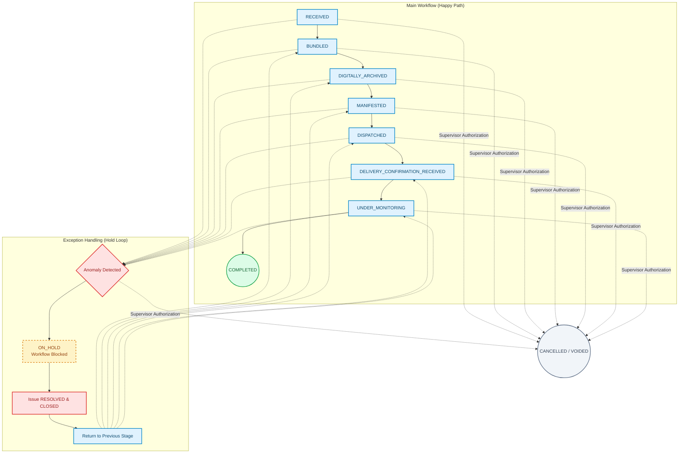

# Workflow Overview

ARCHITAX orchestrates the end-to-end lifecycle of property tax (PBB-P2) service requests through a highly structured, dual-track architecture. It seamlessly bridges physical citizen intake with secure digital processing, designed around two core principles: a linear "Happy Path" for standard processing, and a Centralized Issue Management system for handling exceptions.

This workflow is driven by five core operational principles:

- Accountability: Clear, unambiguous ownership of every task by designated Officers (Reception, Bundling, Digitization, Manifestation, Dispatch, and Monitoring) at every discrete stage.
- Auditability: An immutable, timestamped history of all workflow state changes, bundle/manifest associations, and complete issue lifecycles.
- Role Separation: Strict segregation of duties ensures that the officer receiving documents, digitizing them, and dispatching them are entirely separate, guaranteeing robust checks and balances.
- Service Tracking: Real-time visibility into request progression via Main Workflow Status, supported by automated WhatsApp notifications to keep citizens informed.
- Controlled Progression: Requests can only advance through the linear Happy Path. Any anomaly triggers a centralized Issue, automatically placing the request ON_HOLD until the corrective action is verified and closed.

To ensure operational excellence, scalability, and consistency in a low-digital-literacy environment, the workflow also incorporates:

- Batch Processing Efficiency: Streamlined handling of high volumes through logical grouping into locked Bundles and Manifests, complete with auto-generated official cover letters.
- Centralized Issue Management: A unified system for handling anomalies (e.g., MISSING_DOCUMENT, INVALID_SCAN, DATA_MISMATCH) without creating dozens of complex rejection statuses.
- Workflow Hold Mechanism: Automatic ON_HOLD state blocking progression when a blocking issue is detected. The workflow seamlessly resumes from the exact previous stage once the issue is resolved.
- Document & Evidence Management: Secure digitization, quality verification, and archiving of physical files, alongside the digital capture of signed Manifest Cover Letters as Proof of Delivery.
- SLA & Escalation: Automated monitoring and alerts for violations (e.g., SLA_EXCEEDED, LOST_FILE), triggering immediate escalation to Supervisors for investigation.
- Automated Notifications: Seamless digital handoffs and task alerts between internal Officer roles, alongside real-time status updates sent directly to the citizen's mobile device via WhatsApp.
- Analytics & Reporting: Comprehensive tracking of bundle/manifest throughput, issue resolution times, and officer performance to drive continuous operational improvement.

# Workflow Actors

This document defines the roles and responsibilities of the personnel involved in the Property Tax Service Digitalization System.

---

## 1. Intake & Registration Officer (Officer 1)

**Primary Objective:** Serve as the physical bridge between the citizen and the digital system, ensuring all incoming requests are complete and accurately registered.

### Main Workflow Responsibilities:

- Receive physical application packages from taxpayers.
- Perform initial triage to verify service type and document completeness.
- Record request information into **ARCHITAX**, officially setting the status to `RECEIVED`.

### Issue Management Responsibilities:

- Identify immediate physical anomalies and raise blocking issues (e.g., `MISSING_DOCUMENT`, `DATA_MISMATCH`).
- Place incomplete requests `ON_HOLD` until the citizen provides the correct physical documents.

---

## 2. Bundling & Processing Officer (Officer 2)

**Primary Objective:** Organize individual, registered requests into logical, trackable batches to optimize downstream processing.

### Main Workflow Responsibilities:

- Review `RECEIVED` requests and select eligible ones for grouping.
- Create a **Bundle**, generate a unique Bundle ID (e.g., `973/(number)-UPT.PD.WIL.IV/(year)`), and lock the bundle to prevent unauthorized modifications.
- Generate and print the official **Bundle Cover Letter** (containing the bundle summary, request list, and creation date).
- Advance the status of included requests to `BUNDLED`.

### Issue Management Responsibilities:

- Resolve assignment errors by raising or addressing `WRONG_BUNDLE` issues.
- Execute the "Bundle Reopening" process if a locked bundle must be modified to fix an issue.

---

## 3. Digitization & Archiving Officer (Officer 3)

**Primary Objective:** Create a high-quality, secure digital twin of the physical bundle for long-term storage and remote verification.

### Main Workflow Responsibilities:

- Retrieve physical documents associated with locked bundles.
- Scan all physical files, upload digital copies, and verify scan quality (legibility, orientation) and file completeness.
- Advance the status of the requests to `DIGITALLY_ARCHIVED`.

### Issue Management Responsibilities:

- Identify poor-quality scans and raise `INVALID_SCAN` issues.
- This action immediately triggers the **Workflow Hold Mechanism**, preventing the bundle from moving to Manifestation until the physical document is rescanned and the issue is resolved.

---

## 4. Manifest & Dispatch Admin (Officer 4)

**Primary Objective:** Consolidate digitized bundles for bulk physical transfer and generate the official dispatch documentation.

### Main Workflow Responsibilities:

- Review `DIGITALLY_ARCHIVED` bundles and group them into a **Manifest**.
- Create the Manifest, generate a unique Manifest ID (e.g., `MNF-2026-000001`), and lock the manifest.
- Generate the official **Manifest Cover Letter** (including signature sections, manifest summary, and bundle lists).
- Advance the status of included bundles to `MANIFESTED`.

### Issue Management Responsibilities:

- Identify discrepancies during consolidation and raise `MISSING_BUNDLE` issues.
- Exclude affected bundles from the manifest until the underlying issues are resolved.

---

## 5. Logistics & Delivery Officer (Officer 5)

**Primary Objective:** Execute the secure physical transfer of documents to the destination office and capture verifiable Proof of Delivery.

### Main Workflow Responsibilities:

- Verify the physical delivery package against the Manifest and Bundle Cover Letters.
- Record dispatch details in the system and physically send the package, updating the status to `DISPATCHED`.
- Upon return, receive the signed Manifest Cover Letter from the destination office.
- Scan and upload the signed document as Proof of Delivery, updating the status to `DELIVERY_CONFIRMATION_RECEIVED`.

### Issue Management Responsibilities:

- Identify physical delivery failures and raise `MISSING_CONFIRMATION` or delivery discrepancy issues.
- Initiate follow-up procedures with the destination office to obtain the missing signatures.

---

## 6. Monitoring & Compliance Officer (Officer 6)

**Primary Objective:** Ensure end-to-end completion, track Service Level Agreements (SLAs), and formally close the workflow lifecycle.

### Main Workflow Responsibilities:

- Track all dispatched and delivered requests to verify final outcomes.
- Record final completion status, exact completion dates, and operational remarks.
- Update the status to `UNDER_MONITORING` and, upon final verification, to `COMPLETED`.

### Issue Management Responsibilities:

- Monitor the system dashboard for time-based anomalies and raise `SLA_EXCEEDED` issues.
- Verify that all resolved issues meet quality standards before officially closing them.

---

## 7. Supervisor / Escalation Manager (Implicit Actor)

**Primary Objective:** Provide high-level oversight, resolve critical systemic failures, and manage escalations.

### Main Workflow Responsibilities:

- Review system analytics, bundle/manifest throughput, and overall SLA compliance.
- Authorize manual overrides or system exceptions when strictly necessary (which are heavily logged for Auditability).

### Issue Management Responsibilities:

- Receive automated system notifications for high-severity issues (e.g., `LOST_FILE` or severe `SLA_EXCEEDED` violations).
- Lead investigations into critical failures and assign corrective actions to the responsible Officers.

# Workflow Stages: ARCHITAX System

The ARCHITAX system enforces a strict, linear "Happy Path" for the Main Workflow. A request can only advance to the next stage when all required activities for the current stage are completed and no blocking issues (`ON_HOLD`) are present.

---

### 1. RECEIVED

- **Primary Actor:** Intake & Registration Officer (Officer 1)
- **Description:** The initial entry point of the workflow. The physical application package is received from the taxpayer.
- **Key Activities:**
  - Physical document triage and completeness check.
  - Service type verification.
  - Digital registration of the request metadata into ARCHITAX.
- **Exit Condition:** Request is successfully registered in the system. If documents are missing, an issue is raised, and the request is placed `ON_HOLD`.

### 2. BUNDLED

- **Primary Actor:** Bundling & Processing Officer (Officer 2)
- **Description:** Individual RECEIVED requests are logically grouped into a trackable batch for efficient downstream processing.
- **Key Activities:**
  - Selection of eligible requests.
  - Creation of a Bundle and generation of a unique Bundle ID (e.g., `973/(number)-UPT.PD.WIL.IV/(year)`).
  - Locking the bundle to prevent unauthorized modifications.
  - Generation and printing of the official Bundle Cover Letter.
- **Exit Condition:** Bundle is locked and cover letter is generated.

### 3. DIGITALLY_ARCHIVED

- **Primary Actor:** Digitization & Archiving Officer (Officer 3)
- **Description:** The physical documents within the locked bundle are converted into a secure, high-quality digital format.
- **Key Activities:**
  - Retrieval of physical documents associated with the bundle.
  - Scanning and uploading of all digital files.
  - Verification of scan quality (legibility, orientation) and file completeness.
- **Exit Condition:** All files are successfully uploaded and verified. If a scan is unreadable, an `INVALID_SCAN` issue is raised, placing the request `ON_HOLD` until rescanned.

### 4. MANIFESTED

- **Primary Actor:** Manifest & Dispatch Admin (Officer 4)
- **Description:** Multiple DIGITALLY_ARCHIVED bundles are consolidated into a larger Manifest for bulk physical transfer to the destination office.
- **Key Activities:**
  - Selection of eligible, fully digitized bundles.
  - Creation of a Manifest and generation of a unique Manifest ID (e.g., `MNF-2026-000001`).
  - Locking the manifest.
  - Generation of the official Manifest Cover Letter (including signature sections and bundle lists).
- **Exit Condition:** Manifest is locked and cover letter is generated.

### 5. DISPATCHED

- **Primary Actor:** Logistics & Delivery Officer (Officer 5)
- **Description:** The physical transfer of the documents from the origin office to the destination office.
- **Key Activities:**
  - Physical verification of the delivery package against the Manifest and Bundle Cover Letters.
  - Recording of dispatch details (date, time, courier/vehicle info) in the system.
  - Physical handover of the package.
- **Exit Condition:** Package is physically sent, and dispatch details are logged.

### 6. DELIVERY_CONFIRMATION_RECEIVED

- **Primary Actor:** Logistics & Delivery Officer (Officer 5)
- **Description:** The formal capture of Proof of Delivery (PoD) from the destination office.
- **Key Activities:**
  - Receipt of the physically signed Manifest Cover Letter from the destination office.
  - Scanning and uploading of the signed document into ARCHITAX.
  - Archiving the digital proof of delivery.
- **Exit Condition:** Signed manifest is successfully uploaded and linked to the record. If the signature is missing, a `MISSING_CONFIRMATION` issue is raised.

### 7. UNDER_MONITORING

- **Primary Actor:** Monitoring & Compliance Officer (Officer 6)
- **Description:** The final verification phase to ensure the entire lifecycle was completed correctly and within Service Level Agreements (SLAs).
- **Key Activities:**
  - Tracking all dispatched and delivered requests to verify final outcomes.
  - Recording final completion status, exact completion dates, and operational remarks.
  - Monitoring for any late-stage anomalies (e.g., `SLA_EXCEEDED`).
- **Exit Condition:** All data is verified, remarks are logged, and the request is deemed fully compliant.

### 8. COMPLETED

- **Primary Actor:** Monitoring & Compliance Officer (Officer 6) / System
- **Description:** The terminal state of the workflow. The service request has been fully processed, delivered, and verified.
- **Key Activities:**
  - System finalizes the record.
  - Automated WhatsApp notification sent to the citizen confirming final completion.
  - Record is sealed for long-term archival and auditing.
- **Exit Condition:** None. This is the end of the Happy Path.

---

## Special System States (Parallel to Main Stages)

These are not sequential stages, but rather state modifiers that override the Happy Path when exceptions occur:

- **ON_HOLD:** A temporary, blocking state applied to a request when a centralized Issue (e.g., `MISSING_DOCUMENT`, `INVALID_SCAN`) is raised. The request cannot advance to the next stage. Once the Issue status becomes `RESOLVED` and `CLOSED`, the request automatically reverts to its previous Main Workflow Stage to continue.
- **CANCELLED / VOIDED:** A terminal state applied only by a Supervisor in extreme cases (e.g., fraudulent request, taxpayer withdrawal), which permanently halts the workflow and logs a mandatory audit reason.

# Stage Definitions

## 1. RECEIVED

- **Owner:** Intake & Registration Officer (Officer 1)
- **Purpose:** The physical application package is received from the taxpayer, triaged for completeness, and officially registered into the ARCHITAX system.
- **Allowed Actions:**
  - Register Request (Input metadata)
  - Raise Issue (e.g., MISSING_DOCUMENT, DATA_MISMATCH) → Triggers ON_HOLD
  - Add Note
  - Print Physical Receipt for Citizen
- **Next Stage:** BUNDLED
- **Previous Stage:** None (Initial Stage)

## 2. BUNDLED

- **Owner:** Bundling & Processing Officer (Officer 2)
- **Purpose:** Individual RECEIVED requests are logically grouped into a trackable, locked batch to optimize downstream processing and generate official documentation.
- **Allowed Actions:**
  - Select Requests & Create Bundle
  - Generate Unique Bundle ID (e.g., 973/(number)-UPT.PD.WIL.IV/(year))
  - Generate & Print Bundle Cover Letter
  - Lock Bundle
  - Reopen Bundle (Requires Supervisor authorization if already locked)
  - Raise Issue (e.g., WRONG_BUNDLE) → Triggers ON_HOLD
  - Add Note
- **Next Stage:** DIGITALLY_ARCHIVED
- **Previous Stage:** RECEIVED

## 3. DIGITALLY_ARCHIVED

- **Owner:** Digitization & Archiving Officer (Officer 3)
- **Purpose:** Physical documents within the locked bundle are converted into a secure, high-quality digital format for long-term storage and remote verification.
- **Allowed Actions:**
  - Upload Digital Files / Scans
  - Verify Scan Quality & Completeness
  - Raise Issue (e.g., INVALID_SCAN) → Triggers ON_HOLD
  - Add Note
- **Next Stage:** MANIFESTED
- **Previous Stage:** BUNDLED

## 4. MANIFESTED

- **Owner:** Manifest & Dispatch Admin (Officer 4)
- **Purpose:** Multiple DIGITALLY_ARCHIVED bundles are consolidated into a larger Manifest for bulk physical transfer, complete with official dispatch documentation.
- **Allowed Actions:**
  - Select Bundles & Create Manifest
  - Generate Unique Manifest ID (e.g., MNF-2026-000001)
  - Generate & Print Manifest Cover Letter (with signature sections)
  - Lock Manifest
  - Exclude Bundle from Manifest (Raises MISSING_BUNDLE issue)
  - Add Note
- **Next Stage:** DISPATCHED
- **Previous Stage:** DIGITALLY_ARCHIVED

## 5. DISPATCHED

- **Owner:** Logistics & Delivery Officer (Officer 5)
- **Purpose:** The physical transfer of the document package from the origin office to the destination office is executed and recorded in the system.
- **Allowed Actions:**
  - Verify Physical Package against Cover Letters
  - Record Dispatch Details (Date, Time, Courier/Vehicle)
  - Raise Issue (e.g., DELIVERY_DISCREPANCY) → Triggers ON_HOLD
  - Add Note
- **Next Stage:** DELIVERY_CONFIRMATION_RECEIVED
- **Previous Stage:** MANIFESTED

## 6. DELIVERY_CONFIRMATION_RECEIVED

- **Owner:** Logistics & Delivery Officer (Officer 5)
- **Purpose:** Proof of Delivery (PoD) is formally captured by receiving, scanning, and archiving the signed Manifest Cover Letter from the destination office.
- **Allowed Actions:**
  - Upload Signed Manifest Cover Letter
  - Link PoD to Manifest Record
  - Raise Issue (e.g., MISSING_CONFIRMATION) → Triggers ON_HOLD
  - Add Note
- **Next Stage:** UNDER_MONITORING
- **Previous Stage:** DISPATCHED

## 7. UNDER_MONITORING

- **Owner:** Monitoring & Compliance Officer (Officer 6)
- **Purpose:** The final verification phase to ensure the entire lifecycle was completed correctly, all issues are resolved, and Service Level Agreements (SLAs) were met.
- **Allowed Actions:**
  - Record Final Completion Status & Date
  - Add Operational Remarks
  - Raise Issue (e.g., SLA_EXCEEDED, LOST_FILE) → Triggers Escalation
  - Verify & Close Resolved Issues
  - Finalize & Complete Workflow
- **Next Stage:** COMPLETED
- **Previous Stage:** DELIVERY_CONFIRMATION_RECEIVED

## 8. COMPLETED

- **Owner:** Monitoring & Compliance Officer (Officer 6) / System
- **Purpose:** The terminal state of the workflow. The service request has been fully processed, delivered, verified, and sealed for audit.
- **Allowed Actions:**
  - View Only (Read-Access)
  - Export Audit Log / History
  - (No modifications, edits, or new issues allowed)
- **Next Stage:** None (Terminal Stage)
- **Previous Stage:** UNDER_MONITORING

---

## Special State Modifier: ON_HOLD

_(This is not a sequential stage, but a temporary state modifier that overrides the current stage)_

- **Trigger:** Automatically applied when any Officer raises a blocking Issue (e.g., MISSING_DOCUMENT, INVALID_SCAN).
- **Effect:** \* The "Next Stage" transition is disabled for the current Owner.
  - The request is flagged in the dashboard for the assigned Officer to resolve.
- **Allowed Actions (While ON_HOLD):**
  - Update Issue Status to IN_PROGRESS
  - Perform Corrective Action (e.g., Rescan document, call citizen)
  - Update Issue Status to RESOLVED
  - Add Note
- **Resolution:** Once the Issue is verified and marked CLOSED by the Monitoring Officer or Supervisor, the ON_HOLD state is removed, and the request reverts to its Previous Stage, allowing the Owner to proceed to the Next Stage.

# State Transition Rules

The ARCHITAX system enforces strict state transitions to maintain auditability and role separation. Transitions are only permitted when the required activities for the current stage are complete and no blocking issues are active.

## 1. Main Workflow Transitions (The "Happy Path")

These are the standard, forward-moving transitions for a successfully processed request.

- **RECEIVED → BUNDLED**
  - **Authorized Actor:** Bundling & Processing Officer (Officer 2)
  - **Trigger Condition:** Eligible requests are selected, a unique Bundle ID is generated, the bundle is locked, and the Bundle Cover Letter is printed.
  - **Blocking Condition:** Cannot transition if an ON_HOLD issue (e.g., MISSING_DOCUMENT) is active on the request.

- **BUNDLED → DIGITALLY_ARCHIVED**
  - **Authorized Actor:** Digitization & Archiving Officer (Officer 3)
  - **Trigger Condition:** All physical documents in the locked bundle are scanned, uploaded, and verified for quality and completeness.
  - **Blocking Condition:** Cannot transition if an ON_HOLD issue (e.g., INVALID_SCAN) is active.

- **DIGITALLY_ARCHIVED → MANIFESTED**
  - **Authorized Actor:** Manifest & Dispatch Admin (Officer 4)
  - **Trigger Condition:** Eligible bundles are grouped, a unique Manifest ID is generated, the manifest is locked, and the Manifest Cover Letter is printed.
  - **Blocking Condition:** Cannot transition if an ON_HOLD issue (e.g., MISSING_BUNDLE) is active on any included bundle.

- **MANIFESTED → DISPATCHED**
  - **Authorized Actor:** Logistics & Delivery Officer (Officer 5)
  - **Trigger Condition:** Physical package is verified against cover letters, dispatch details (date, time, courier) are recorded, and the package is physically handed over.

- **DISPATCHED → DELIVERY_CONFIRMATION_RECEIVED**
  - **Authorized Actor:** Logistics & Delivery Officer (Officer 5)
  - **Trigger Condition:** The physically signed Manifest Cover Letter is received from the destination office, scanned, and uploaded as Proof of Delivery (PoD).
  - **Blocking Condition:** Cannot transition if an ON_HOLD issue (e.g., MISSING_CONFIRMATION) is active.

- **DELIVERY_CONFIRMATION_RECEIVED → UNDER_MONITORING**
  - **Authorized Actor:** Monitoring & Compliance Officer (Officer 6)
  - **Trigger Condition:** Final completion status, exact dates, and operational remarks are recorded, and the request is deemed fully compliant.

- **UNDER_MONITORING → COMPLETED**
  - **Authorized Actor:** Monitoring & Compliance Officer (Officer 6) / System
  - **Trigger Condition:** All data is verified, all issues are officially closed, and the workflow is finalized. The system seals the record and triggers the final citizen WhatsApp notification.

## 2. Exception Transitions (Workflow Hold Mechanism)

These transitions handle anomalies without breaking the linear audit trail of the Main Workflow.

- **[Any Main Stage] → ON_HOLD**
  - **Authorized Actor:** Any Officer (depending on the stage) or System (for SLA violations)
  - **Trigger Condition:** A blocking Issue is raised (e.g., MISSING_DOCUMENT, INVALID_SCAN, WRONG_BUNDLE, SLA_EXCEEDED).
  - **Effect:** All forward transitions from the current stage are immediately disabled. The request is flagged in the dashboard for corrective action.

- **ON_HOLD → [Previous Main Stage]**
  - **Authorized Actor:** System (Automated upon Issue Closure)
  - **Trigger Condition:** The assigned Officer performs the corrective action, marks the Issue as RESOLVED, and the Monitoring Officer or Supervisor verifies and marks it CLOSED.
  - **Effect:** The ON_HOLD state modifier is removed, and the request reverts to the exact stage it was in when the issue was raised (e.g., if it was held during DIGITALLY_ARCHIVED, it returns to DIGITALLY_ARCHIVED), allowing the Owner to proceed forward.

## 3. Terminal Exception Transitions

These transitions permanently halt the workflow and are strictly controlled.

- **[Any Main Stage] or ON_HOLD → CANCELLED / VOIDED**
  - **Authorized Actor:** Supervisor / Escalation Manager (Implicit Actor) ONLY
  - **Trigger Condition:** Extreme cases such as confirmed fraudulent requests, formal taxpayer withdrawal, or permanently LOST_FILE with no possibility of recovery.
  - **Effect:** The workflow is permanently terminated. No further actions, edits, or issue resolutions are permitted. A mandatory audit reason and Supervisor authorization log are permanently attached to the record.

# Rejection Rules

In the ARCHITAX system, anomalies are not handled by "rejecting" a request to a previous stage. Instead, they are handled by raising a centralized Issue, which automatically triggers the Workflow Hold Mechanism (ON_HOLD). The workflow can only resume its linear "Happy Path" once the issue is resolved and closed.

Below are the standard Issue Triggers mapped to their respective workflow stages, actors, and resolution paths.

---

### 1. Incomplete Physical Submission

- **Trigger Stage:** RECEIVED
- **Primary Actor:** Intake & Registration Officer (Officer 1)
- **Issue Type:** `MISSING_DOCUMENT` or `DATA_MISMATCH`
- **Trigger Condition:** The physical application package lacks mandatory documents or contains obvious data errors during initial triage.
- **System Action:** Request status is immediately set to `ON_HOLD`. Progression to `BUNDLED` is blocked.
- **Resolution Path:**
  - Officer 1 contacts the citizen (via phone/WhatsApp) to request the missing information.
  - Citizen provides the correct physical documents.
  - Officer 1 updates the record, marks the Issue as `RESOLVED`, and the Monitoring Officer/Supervisor verifies and marks it `CLOSED`.
  - Request reverts to `RECEIVED` and can proceed to `BUNDLED`.

### 2. Poor Scan Quality or Missing Digital Files

- **Trigger Stage:** DIGITALLY_ARCHIVED
- **Primary Actor:** Digitization & Archiving Officer (Officer 3)
- **Issue Type:** `INVALID_SCAN`
- **Trigger Condition:** Uploaded digital files are illegible, incorrectly oriented, or do not match the physical documents in the locked bundle.
- **System Action:** Request status is set to `ON_HOLD`. Progression to `MANIFESTED` is blocked.
- **Resolution Path:**
  - Officer 3 (or designated staff) retrieves the physical document from the bundle.
  - The document is rescanned and the new digital file is uploaded, replacing the invalid one.
  - The Issue is marked `RESOLVED` and `CLOSED`.
  - Request reverts to `DIGITALLY_ARCHIVED` and can proceed to `MANIFESTED`.

### 3. Incorrect Bundle Assignment

- **Trigger Stage:** BUNDLED
- **Primary Actor:** Bundling & Processing Officer (Officer 2) / Supervisor
- **Issue Type:** `WRONG_BUNDLE`
- **Trigger Condition:** A request was accidentally grouped into the wrong Bundle, or a Bundle was locked with incorrect contents.
- **System Action:** The specific request or bundle is placed `ON_HOLD`.
- **Resolution Path:**
  - Officer 2 identifies the error and requests a "Bundle Reopening."
  - Supervisor authorizes the reopening (logged in Audit History).
  - Officer 2 removes the request from the incorrect bundle and assigns it to the correct one.
  - The Issue is marked `RESOLVED` and `CLOSED`.
  - Request reverts to `BUNDLED` and can proceed.

### 4. Missing Bundle During Manifest Consolidation

- **Trigger Stage:** MANIFESTED
- **Primary Actor:** Manifest & Dispatch Admin (Officer 4)
- **Issue Type:** `MISSING_BUNDLE`
- **Trigger Condition:** A bundle that was supposed to be included in a Manifest is physically missing or not yet `DIGITALLY_ARCHIVED`.
- **System Action:** The affected bundle is excluded from the Manifest, and an Issue is raised against the bundle.
- **Resolution Path:**
  - Officer 4 investigates the missing bundle's status.
  - Once the underlying issue (e.g., `INVALID_SCAN`) is resolved and the bundle is ready, it is added to a new Manifest.
  - The Issue is marked `RESOLVED` and `CLOSED`.

### 5. Missing Proof of Delivery (Signed Manifest)

- **Trigger Stage:** DISPATCHED (Attempting to reach `DELIVERY_CONFIRMATION_RECEIVED`)
- **Primary Actor:** Logistics & Delivery Officer (Officer 5)
- **Issue Type:** `MISSING_CONFIRMATION` or `DELIVERY_DISCREPANCY`
- **Trigger Condition:** The destination office fails to sign and return the Manifest Cover Letter, or the physical package count does not match the Manifest.
- **System Action:** The Manifest/Request is placed `ON_HOLD`. Progression to `UNDER_MONITORING` is blocked.
- **Resolution Path:**
  - Officer 5 initiates follow-up procedures with the destination office.
  - The signed Manifest Cover Letter is obtained, scanned, and uploaded.
  - The Issue is marked `RESOLVED` and `CLOSED`.
  - Request reverts to `DELIVERY_CONFIRMATION_RECEIVED` and can proceed to `UNDER_MONITORING`.

### 6. Lost Physical File

- **Trigger Stage:** Any Stage
- **Primary Actor:** Any Officer (Escalated to Supervisor)
- **Issue Type:** `LOST_FILE`
- **Trigger Condition:** A physical document or entire bundle cannot be located within the office.
- **System Action:** Immediate `ON_HOLD` status. Automated high-severity notification sent to the Supervisor / Escalation Manager.
- **Resolution Path:**
  - Supervisor leads a formal investigation.
  - If found, the workflow resumes.
  - If permanently lost, the Supervisor may authorize a `CANCELLED` / `VOIDED` terminal state, requiring the citizen to restart the process, with a mandatory audit reason logged.

### 7. Service Level Agreement (SLA) Violation

- **Trigger Stage:** Any Stage (Most commonly `UNDER_MONITORING` or stuck in `ON_HOLD`)
- **Primary Actor:** System (Automated) / Monitoring & Compliance Officer (Officer 6)
- **Issue Type:** `SLA_EXCEEDED`
- **Trigger Condition:** A request or bundle remains in a single stage or `ON_HOLD` state beyond the predefined time limit (e.g., > 48 hours).
- **System Action:** System automatically generates an `SLA_EXCEEDED` issue and flags the dashboard.
- **Resolution Path:**
  - Supervisor reviews the bottleneck.
  - Supervisor reassigns the task or provides expedited approval.
  - The Issue is documented, marked `RESOLVED`, and `CLOSED`.

# Approval Rules: ARCHITAX System

In the ARCHITAX system, approvals enforce Role Separation and Controlled Progression. An officer can only approve a transition to the next stage when all exit conditions are met and no blocking issues (`ON_HOLD`) are active.

---

## 1. Bundle Creation & Locking

- **Stage Transition:** `RECEIVED` → `BUNDLED`
- **Approver:** Bundling & Processing Officer (Officer 2)
- **Conditions:**
  - Eligible requests are selected and validated.
  - Unique Bundle ID (e.g., `973/(number)-UPT.PD.WIL.IV/(year)`) is generated.
  - Official Bundle Cover Letter is generated and printed.
  - No active blocking issues (`ON_HOLD`) exist on any of the included requests.

## 2. Digitization Verification

- **Stage Transition:** `BUNDLED` → `DIGITALLY_ARCHIVED`
- **Approver:** Digitization & Archiving Officer (Officer 3)
- **Conditions:**
  - All physical documents in the locked bundle are scanned and uploaded.
  - Scan quality (legibility, orientation) is visually verified.
  - Digital file completeness is verified against the physical bundle contents.

## 3. Manifest Creation & Locking

- **Stage Transition:** `DIGITALLY_ARCHIVED` → `MANIFESTED`
- **Approver:** Manifest & Dispatch Admin (Officer 4)
- **Conditions:**
  - Eligible, fully digitized bundles are selected.
  - Unique Manifest ID (e.g., `MNF-2026-000001`) is generated.
  - Official Manifest Cover Letter (including signature sections and bundle lists) is generated and printed.
  - No active blocking issues (`ON_HOLD`) exist on any of the included bundles.

## 4. Physical Dispatch Authorization

- **Stage Transition:** `MANIFESTED` → `DISPATCHED`
- **Approver:** Logistics & Delivery Officer (Officer 5)
- **Conditions:**
  - Physical delivery package is physically verified against the Manifest and Bundle Cover Letters.
  - Dispatch details (date, time, courier/vehicle info) are accurately recorded in the system.
  - Physical handover of the package is executed.

## 5. Proof of Delivery (PoD) Validation

- **Stage Transition:** `DISPATCHED` → `DELIVERY_CONFIRMATION_RECEIVED`
- **Approver:** Logistics & Delivery Officer (Officer 5)
- **Conditions:**
  - Physically signed Manifest Cover Letter is received back from the destination office.
  - Signed document is successfully scanned and uploaded to ARCHITAX.
  - PoD is digitally linked to the correct Manifest record.

## 6. Final Compliance Verification

- **Stage Transition:** `DELIVERY_CONFIRMATION_RECEIVED` → `UNDER_MONITORING`
- **Approver:** Monitoring & Compliance Officer (Officer 6)
- **Conditions:**
  - Final completion status and exact completion dates are recorded.
  - Operational remarks are logged.
  - The entire lifecycle is verified as fully compliant with Service Level Agreements (SLAs).

## 7. Workflow Final Closure

- **Stage Transition:** `UNDER_MONITORING` → `COMPLETED`
- **Approver:** Monitoring & Compliance Officer (Officer 6) / System
- **Conditions:**
  - All workflow data is fully verified.
  - All associated centralized Issues are officially marked `CLOSED`.
  - System seals the record for audit and triggers the final citizen WhatsApp notification.

---

## Special Authorization Rules (Exceptions & Overrides)

Because ARCHITAX uses a Centralized Issue Management system, certain critical actions require explicit authorization from a higher authority to maintain Auditability and prevent unauthorized alterations.

### Bundle Reopening

- **Action:** Unlocking a previously locked Bundle to modify its contents.
- **Approver:** Supervisor / Escalation Manager
- **Conditions:**
  - A valid issue (e.g., `WRONG_BUNDLE`) has been raised.
  - Supervisor explicitly authorizes the reopening.
  - The authorization is heavily logged in the Audit History.

### Issue Resolution & Closure

- **Action:** Marking a centralized Issue as `CLOSED` to remove the `ON_HOLD` state from a request.
- **Approver:** Monitoring & Compliance Officer (Officer 6) or Supervisor
- **Conditions:**
  - The assigned Officer has performed the corrective action and marked the Issue as `RESOLVED`.
  - The Approver verifies that the corrective action meets quality standards before officially closing it.

### Terminal State Authorization

- **Action:** Transitioning a request to `CANCELLED` / `VOIDED`.
- **Approver:** Supervisor / Escalation Manager ONLY
- **Conditions:**
  - An extreme case is confirmed (e.g., fraudulent request, formal taxpayer withdrawal, or permanently `LOST_FILE`).
  - A mandatory audit reason and Supervisor authorization log are permanently attached to the record.

### Manual System Overrides

- **Action:** Bypassing standard system validations or forcing a state transition.
- **Approver:** Supervisor / Escalation Manager ONLY
- **Conditions:**
  - Strictly necessary for resolving systemic failures.
  - Action is heavily logged for Auditability.

# Task Ownership Rules

In the ARCHITAX system, ownership is strictly tied to the current Workflow Stage or Issue Status. An officer is only considered the "Owner" of a task when it is in their designated stage, ensuring clear accountability.

## Main Workflow Ownership

| Workflow Stage                     | Owner                                        | Responsibility                                                                                          |
| :--------------------------------- | :------------------------------------------- | :------------------------------------------------------------------------------------------------------ |
| **RECEIVED**                       | Intake & Registration Officer (Officer 1)    | Triage, metadata entry, and raising initial MISSING_DOCUMENT or DATA_MISMATCH issues.                   |
| **BUNDLED**                        | Bundling & Processing Officer (Officer 2)    | Selecting requests, generating Bundle IDs, locking bundles, and printing Bundle Cover Letters.          |
| **DIGITALLY_ARCHIVED**             | Digitization & Archiving Officer (Officer 3) | Scanning physical documents, uploading files, and verifying scan quality.                               |
| **MANIFESTED**                     | Manifest & Dispatch Admin (Officer 4)        | Consolidating bundles, generating Manifest IDs, locking manifests, and printing Manifest Cover Letters. |
| **DISPATCHED**                     | Logistics & Delivery Officer (Officer 5)     | Verifying physical packages, recording dispatch details, and executing physical handover.               |
| **DELIVERY_CONFIRMATION_RECEIVED** | Logistics & Delivery Officer (Officer 5)     | Receiving, scanning, and uploading the signed Manifest Cover Letter as Proof of Delivery (PoD).         |
| **UNDER_MONITORING**               | Monitoring & Compliance Officer (Officer 6)  | Final verification, recording completion dates/remarks, and closing resolved issues.                    |
| **COMPLETED**                      | System (Read-Only) / Officer 6               | No active ownership. The record is sealed for archival and auditing.                                    |

## Issue Management Ownership

| Issue Status    | Owner                                                     | Responsibility                                                                |
| :-------------- | :-------------------------------------------------------- | :---------------------------------------------------------------------------- |
| **OPEN**        | System (Auto-assigned) or Officer who raised it           | Acknowledge the issue and begin corrective action.                            |
| **IN_PROGRESS** | Specifically Assigned Officer                             | Perform the corrective action (e.g., rescan document, contact citizen).       |
| **RESOLVED**    | Monitoring & Compliance Officer (Officer 6) or Supervisor | Verify that the corrective action meets quality standards and mark as CLOSED. |
| **CLOSED**      | System (Read-Only)                                        | Immutable historical record.                                                  |

## Assignment Rules

To maintain Controlled Progression and prevent unauthorized task hoarding or dumping, task assignments in ARCHITAX follow strict rules. Tasks may be assigned in one of three ways:

### 1. Auto-Assigned (Default Behavior)

- **Trigger:** When a request transitions to a new stage, it is automatically placed into the general work queue of the designated Owner for that stage.
- **Example:** When Officer 2 locks a bundle, all requests within it are auto-assigned to the DIGITALLY_ARCHIVED queue, making them visible to Officer 3.
- **Issue Auto-Assignment:** When an issue is raised (e.g., INVALID_SCAN), it is automatically assigned to the Officer responsible for that specific stage (Officer 3) to fix.

### 2. Manually Assigned (Supervisor / Admin Action)

- **Trigger:** A Supervisor or designated Admin manually routes a specific request, bundle, or issue to a specific individual officer.
- **Use Cases:**
  - Distributing workload evenly among multiple officers of the same role (e.g., assigning specific bundles to Officer 3A vs. Officer 3B).
  - Assigning a complex IN_PROGRESS issue to a senior staff member for specialized handling.
- **Audit Requirement:** The system must log who performed the manual assignment and when.

### 3. Reassigned (Strictly Controlled)

- **Trigger:** An already assigned task or issue needs to be moved to a different officer.
- **Rule:** Only a Supervisor / Escalation Manager is authorized to reassign a task. Regular officers cannot reassign their own tasks to avoid evading accountability or SLA timers.
- **Conditions for Reassignment:**
  - The original assignee is absent, on leave, or overwhelmed.
  - A conflict of interest is identified.
  - The task has exceeded its SLA and requires escalation.
- **Audit Requirement:** Reassignment must include a mandatory "Reason for Reassignment" note, which is permanently recorded in the Audit History.

# Notes and Comments Rules

To ensure clear communication between Officers and maintain an unassailable audit trail, the ARCHITAX system enforces strict rules regarding when notes are mandatory versus optional.

### 1. Mandatory Notes (System Enforced)

The system will block the user from proceeding unless a note is provided in the following scenarios:

- **Raising an Issue (ON_HOLD):** When any Officer identifies an anomaly (e.g., `INVALID_SCAN`, `MISSING_DOCUMENT`), they must provide a detailed description of the defect to guide the corrective action.
- **Resolving an Issue:** When an Officer performs a corrective action and marks an Issue as `RESOLVED`, they must document exactly what was done (e.g., "Rescanned page 3 of KTP, uploaded new file replacing old one").
- **Closing an Issue:** When the Monitoring Officer (Officer 6) or Supervisor verifies the fix and marks the Issue as `CLOSED`, a verification note confirming the quality of the resolution is required.
- **Reassigning a Task:** Since only Supervisors can reassign tasks, a mandatory "Reason for Reassignment" (e.g., "Officer 3 on medical leave, shifting batch to Officer 3B") must be logged.
- **Cancelling / Voiding:** A mandatory, detailed justification from the Supervisor is required to permanently terminate a workflow (e.g., "Taxpayer formally withdrew application via signed letter").
- **Bundle/Manifest Reopening:** If a locked Bundle or Manifest must be reopened to fix an error, the Supervisor's authorization reason must be explicitly logged.

### 2. Contextual & Operational Notes (Best Practice)

These are highly recommended or required by specific UI forms to provide context for downstream Officers:

- **Dispatch Details:** Officer 5 adds notes regarding the courier name, vehicle plate number, or specific handover instructions.
- **Monitoring Remarks:** Officer 6 adds operational remarks during the `UNDER_MONITORING` stage before finalizing completion.
- **Citizen Communication:** Officer 1 logs notes when contacting a citizen regarding missing physical documents (e.g., "Called citizen at 10:00 AM, promised to bring original PBB receipt tomorrow").

---

# Audit Log Events

The ARCHITAX system maintains an immutable, timestamped history of all actions. Audit events are categorized by workflow domain to ensure full traceability of the Main Workflow, Issue Lifecycles, and Administrative Overrides.

### 1. Main Workflow Events (The Happy Path)

- **REQUEST_REGISTERED:** Officer 1 creates the initial record and sets status to `RECEIVED`.
- **BUNDLE_CREATED:** Officer 2 groups requests and generates a unique Bundle ID.
- **BUNDLE_LOCKED:** Officer 2 finalizes the bundle and generates the Cover Letter (Status: `BUNDLED`).
- **FILES_UPLOADED:** Officer 3 uploads digital scans to the system.
- **DIGITIZATION_VERIFIED:** Officer 3 confirms scan quality and completeness (Status: `DIGITALLY_ARCHIVED`).
- **MANIFEST_CREATED:** Officer 4 groups bundles and generates a unique Manifest ID.
- **MANIFEST_LOCKED:** Officer 4 finalizes the manifest and generates the Cover Letter (Status: `MANIFESTED`).
- **PACKAGE_DISPATCHED:** Officer 5 records physical handover details (Status: `DISPATCHED`).
- **POD_UPLOADED:** Officer 5 uploads the signed Manifest Cover Letter as Proof of Delivery (Status: `DELIVERY_CONFIRMATION_RECEIVED`).
- **REQUEST_COMPLETED:** Officer 6 / System seals the record and triggers final notification (Status: `COMPLETED`).

### 2. Issue & Hold Mechanism Events

- **ISSUE_OPENED:** An anomaly is detected, and a blocking Issue is created by an Officer or the System.
- **WORKFLOW_HOLD_ACTIVATED:** The system automatically blocks progression due to an open blocking Issue (Status modifier: `ON_HOLD`).
- **ISSUE_IN_PROGRESS:** An Officer acknowledges and begins corrective action on an Issue.
- **ISSUE_RESOLVED:** Corrective action is completed by the assigned Officer.
- **ISSUE_CLOSED:** Monitoring Officer / Supervisor verifies and officially closes the Issue.
- **WORKFLOW_HOLD_RELEASED:** The system automatically unblocks the request, returning it to the previous Main Stage to resume the Happy Path.

### 3. Administrative & Override Events

- **TASK_REASSIGNED:** Supervisor moves a task, bundle, or issue to a different Officer.
- **BUNDLE_REOPENED:** Supervisor authorizes unlocking a previously locked Bundle.
- **MANIFEST_UNLOCKED:** Supervisor authorizes modifying a locked Manifest.
- **REQUEST_VOIDED:** Supervisor permanently cancels the workflow (Terminal State).

### 4. Communication & Notification Events

- **WHATSAPP_CITIZEN_NOTIFIED:** System successfully sends an automated status update to the taxpayer.
- **WHATSAPP_DELIVERY_FAILED:** System fails to send a WhatsApp message (flags the record for manual Frontdesk follow-up).
- **SLA_BREACH_ALERT:** System automatically flags a request or bundle for exceeding predefined time limits.

---

# Audit Log Data Schema (For Developers)

To ensure the database captures exactly what is required by Section 9 of your WORKFLOW.md, every single Audit Log Event must record the following data payload:

```json
{
  "event_id": "UUID",
  "timestamp": "ISO-8601 DateTime",
  "actor": {
    "user_id": "Officer ID",
    "role": "e.g., Digitization & Archiving Officer"
  },
  "target_entity": {
    "type": "REQUEST | BUNDLE | MANIFEST | ISSUE",
    "id": "e.g., REQ-2026-001 or BND-2026-000001"
  },
  "event_type": "e.g., DIGITIZATION_VERIFIED | ISSUE_OPENED",
  "previous_state": "e.g., BUNDLED | OPEN",
  "new_state": "e.g., DIGITALLY_ARCHIVED | IN_PROGRESS",
  "metadata": {
    "previous_value": "e.g., scan_v1.pdf",
    "new_value": "e.g., scan_v2.pdf",
    "mandatory_note": "Rescanned due to blur",
    "ip_address": "192.168.1.50",
    "device_id": "Workstation-03"
  }
}
```

# Notification Rules & SLA Specification: ARCHITAX

In ARCHITAX, notifications are divided into two distinct channels: **Internal System Alerts** for Officers/Supervisors to maintain workflow momentum, and **External WhatsApp Messages** to keep citizens informed without requiring them to log into a portal.

---

## 1. Internal Notifications (System to Staff)

These notifications ensure seamless handoffs between Officers and immediate visibility for exceptions.

- **Stage Transition Handoff:** When a request/bundle/manifest successfully transitions to the next stage, the designated Owner for that new stage receives a dashboard alert and task assignment.
  - _Example:_ When Officer 2 locks a Bundle (BUNDLED), Officer 3 (Digitization) is notified.
- **Issue Raised (ON_HOLD):** When a blocking issue is created, an immediate alert is sent to the assigned resolving Officer and the Supervisor.
  - _Example:_ Officer 3 raises `INVALID_SCAN`. Officer 3 and the Supervisor receive an alert that the workflow is blocked.
- **Issue Resolved (Pending Closure):** When an Officer marks an issue as `RESOLVED`, an alert is sent to the Monitoring Officer (Officer 6) or Supervisor to verify and `CLOSE` the issue.
- **SLA Breach Alert:** When a task exceeds its defined SLA, the system automatically triggers an `SLA_EXCEEDED` issue and sends a high-priority escalation notification to the Supervisor.
- **Authorization Request:** When Officer 2 or 4 requests to reopen a locked Bundle/Manifest, a mandatory approval notification is sent to the Supervisor.

---

## 2. External Notifications (System to Citizen via WhatsApp)

These automated messages provide real-time Service Tracking for the citizen.

| Trigger Event          | Message Content                                                                                                                             |
| :--------------------- | :------------------------------------------------------------------------------------------------------------------------------------------ |
| **Request Registered** | "Your PBB-P2 request [Tracking ID] has been successfully received at the tax office. We will process it shortly."                           |
| **Action Required**    | "Action Required: Your request [Tracking ID] is on hold. Please bring [Missing Document] to the Frontdesk. Reply to this message for help." |
| **Dispatched**         | "Update: Your request [Tracking ID] has been dispatched to the processing office. Estimated completion: [Date]."                            |
| **Completed**          | "Success: Your PBB-P2 request [Tracking ID] is fully processed and ready for collection at the Frontdesk."                                  |
| **Cancelled**          | "Notice: Your request [Tracking ID] has been cancelled. Reason: [Reason]. Please contact the office for details."                           |

---

## 3. SLA (Service Level Agreement) Rules

To ensure Batch Processing Efficiency and prevent bottlenecks, ARCHITAX enforces strict time limits. If an SLA is breached, the system automatically generates an `SLA_EXCEEDED` issue, triggering the escalation protocol.

### Main Workflow SLAs (The Happy Path)

_Note: The SLA clock pauses automatically if the request enters the `ON_HOLD` state._

| Workflow Stage        | Max Time | Primary Owner | Escalation Trigger |
| :-------------------- | :------- | :------------ | :----------------- |
| RECEIVED              | 4 Hours  | Officer 1     | Supervisor         |
| BUNDLED               | 1 Day    | Officer 2     | Supervisor         |
| DIGITALLY_ARCHIVED    | 2 Days   | Officer 3     | Supervisor         |
| MANIFESTED            | 1 Day    | Officer 4     | Supervisor         |
| DISPATCHED            | 3 Days   | Officer 5     | Supervisor         |
| DELIVERY_CONFIRMATION | 2 Days   | Officer 5     | Supervisor         |
| UNDER_MONITORING      | 1 Day    | Officer 6     | Supervisor         |

### Issue Resolution SLAs

| Issue Type           | Max Time | Primary Resolver | Escalation Trigger |
| :------------------- | :------- | :--------------- | :----------------- |
| MISSING_DOCUMENT     | 3 Days   | Officer 1        | Supervisor         |
| DATA_MISMATCH        | 1 Day    | Officer 1        | Supervisor         |
| INVALID_SCAN         | 1 Day    | Officer 3        | Supervisor         |
| WRONG_BUNDLE         | 1 Day    | Officer 2        | Supervisor         |
| MISSING_BUNDLE       | 1 Day    | Officer 4        | Supervisor         |
| MISSING_CONFIRMATION | 3 Days   | Officer 5        | Supervisor         |
| LOST_FILE            | 5 Days   | Supervisor       | Head of Office     |
| SLA_EXCEEDED         | 1 Day    | Supervisor       | Head of Office     |

---

## 4. Exceptional Cases (Terminal States)

The only terminal exception state is `CANCELLED / VOIDED`. This permanently ends the workflow and seals the record.

### Execution Process:

1.  **Initiation:** An Officer identifies the scenario and raises a high-severity issue (e.g., `LOST_FILE`) or submits a cancellation request.
2.  **Authorization:** The Supervisor reviews and, if approved, executes the `CANCELLED / VOIDED` transition.
3.  **Mandatory Audit:** The Supervisor must input a detailed "Reason for Cancellation," which is permanently locked in the Audit Log.
4.  **Notification:** The system sends a `CANCELLED` WhatsApp notification to the citizen.
5.  **Sealing:** The record is locked. Associated Bundles/Manifests are flagged to ensure the rest of the batch continues processing normally.

### Trigger Scenarios:

- **Citizen Withdrawal:** Formal request to cancel the application.
- **Confirmed Fraud:** Discovery of forged documents or fraudulent data.
- **Permanently Lost File:** Physical document declared lost after a 5-day investigation.
- **System Override:** Supervisor-led termination due to systemic failure or legal constraint.

# Workflow Diagram

The ARCHITAX system enforces a strict, linear "Happy Path" for standard processing, combined with a parallel Exception Handling track. Traditional backward "rejection" transitions are intentionally avoided to maintain a clean, auditable, and linear history.

## 1. Main Workflow (The "Happy Path")

This is the standard, forward-moving progression of a successfully processed request.

`RECEIVED` → `BUNDLED` → `DIGITALLY_ARCHIVED` → `MANIFESTED` → `DISPATCHED` → `DELIVERY_CONFIRMATION_RECEIVED` → `UNDER_MONITORING` → `COMPLETED`

## 2. Exception Handling (The "Hold" Loop)

Instead of rejecting a request to a previous stage, any anomaly (e.g., `MISSING_DOCUMENT`, `INVALID_SCAN`, `SLA_EXCEEDED`) triggers a centralized Issue. This places the request in an `ON_HOLD` state, blocking forward progression until the issue is resolved.

1.  **[Current Stage]**
2.  **↓ (Anomaly Detected)**
3.  **`ON_HOLD`** (Issue Raised & Blocking Progression)
4.  **↓ (Corrective Action Taken & Issue Marked RESOLVED)**
5.  **Issue Verified & CLOSED** by Monitoring/Supervisor
6.  **↓ (System Auto-Release)**
7.  **[Return to Previous Stage]**
8.  **↓**
9.  **Continue Main Workflow (Happy Path)**

> **Example:** If a scan is invalid during the `DIGITALLY_ARCHIVED` stage, the request goes `ON_HOLD`. Once Officer 3 rescans the document and the issue is closed, the request returns to `DIGITALLY_ARCHIVED` (not `BUNDLED`), allowing it to proceed to `MANIFESTED`.

## 3. Terminal Exception (Cancellation)

In extreme scenarios, the workflow can be permanently halted. This is a one-way transition that cannot be reversed.

- **[Any Main Stage]** or **[ON_HOLD]**
- **↓ (Supervisor Authorization & Mandatory Audit Note)**
- **`CANCELLED / VOIDED`** (Terminal State)

## Visual Representation (Mermaid.js)



# Manifest Integrity & Partial Manifest Rules

To ensure the legal and physical integrity of the Manifest Cover Letter, the system enforces strict rules regarding bundle inclusion:

1. **Pre-Lock Validation:** Before Officer 4 can lock a Manifest, the system automatically runs a health check on all selected bundles. If any bundle is in an `ON_HOLD` state, the system **blocks** the Manifest from being locked until the defective bundle is removed from the selection.
2. **Post-Lock Exclusion (Manifest Amendment):** If a bundle encounters an issue (e.g., `LOST_FILE` or physical damage) _after_ the Manifest has been locked and the Cover Letter printed, the bundle cannot be silently deleted.
   - Officer 5 (Logistics) must flag the specific bundle as `EXCLUDED_FROM_DISPATCH`.
   - The system generates a **Manifest Amendment Note** on the digital record.
   - Officer 5 physically removes the bundle from the package but retains the original Manifest Cover Letter, manually crossing out the excluded bundle and initialing it, which is then scanned and uploaded as part of the Proof of Delivery (PoD).

# Physical Document Lifecycle & Retention Policy

While ARCHITAX manages the _digital_ twin of the request, the physical documents must be managed according to strict retention policies to prevent office overcrowding and ensure legal compliance.

## Post-Completion Physical Disposition

Once a request reaches the `COMPLETED` stage, the physical file is no longer needed for daily workflow processing. The physical lifecycle is as follows:

1. **Local Holding (Days 1–30):** After `COMPLETED`, physical bundles are moved from the active processing floor to a "Local Holding" storage area within the origin office.
2. **Central Physical Archive (Days 31–365):** Once a month, the Logistics & Delivery Officer (Officer 5) batches all `COMPLETED` physical files and transfers them to the Central Government Physical Archive facility.
3. **Secure Destruction (Year 5+):** In accordance with national property tax data retention laws, physical documents that have reached the end of their legal retention period (e.g., 5 years) are securely shredded by the Central Archive.
   - _Note: The digital twin in ARCHITAX remains permanently sealed and immutable for historical auditing, even after the physical paper is destroyed._

# SLA Visualization & Dashboard Requirements (Traffic Light System)

To ensure proactive monitoring by the Monitoring & Compliance Officer (Officer 6) and the Supervisor, the ARCHITAX dashboard must feature a visual "Traffic Light" SLA tracking system for all active Bundles, Manifests, and Issues.

## Traffic Light Logic

The system calculates the percentage of elapsed time against the defined SLA for the current stage:

- 🟢 **GREEN (Safe):** Elapsed time is **< 50%** of the maximum SLA. (No action required).
- 🟡 **YELLOW (Approaching Breach):** Elapsed time is **> 75%** of the maximum SLA. (Triggers a passive dashboard warning; Officer should prioritize the task).
- 🔴 **RED (SLA Breached):** Elapsed time is **> 100%** of the maximum SLA. (Triggers an automatic `SLA_EXCEEDED` issue, turns the dashboard row red, and sends an immediate escalation alert to the Supervisor).
- ⚪ **GRAY (On Hold):** The request is in an `ON_HOLD` state. The SLA timer is visually paused, and the row is grayed out to indicate it is waiting on external action (e.g., citizen response).

## Supervisor Dashboard View

The Supervisor’s main dashboard must default to a **"Red-First" sorting order**, immediately highlighting any Bundles or Manifests currently in 🔴 RED status, ensuring that bottlenecks are addressed before they impact downstream logistics.
