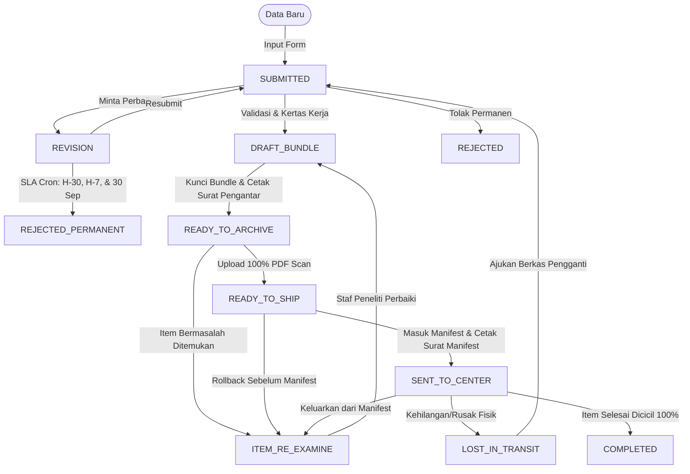

```markdown
# PRODUCT REQUIREMENT DOCUMENT (PRD) - ARCHITAX v2.0
**Dokumen ini adalah Sumber Kebenaran Utama (Single Source of Truth).** Seluruh alur logika, batasan sistem, spesifikasi teknologi, dan desain antarmuka wajib merujuk pada dokumen ini. Implementasi harus rapi, terstruktur, dan mengutamakan ketahanan data (data resilience).

---
## 1. EKSEKUTIF SUMMARY & PRINSIP INTI
**Architax** merupakan sistem manajemen alur kerja internal (*internal workflow system*) yang dirancang khusus untuk mendigitalisasi dan mengoptimalkan proses permohonan Pajak Bumi dan Bangunan (PBB) di lingkungan **Unit Pelaksana Teknis Daerah (UPTD) Pajak Wilayah IV Pakuhaji**.

Sistem ini mengotomatisasi siklus hidup permohonan secara menyeluruh dan terintegrasi, mencakup: penginputan data, validasi administratif, pengelompokan berkas (*bundling*), penyusunan kertas kerja dinamis (khusus untuk jenis mutasi), penerbitan surat pengantar otomatis, pengarsipan digital, penyusunan manifest pengiriman, hingga pemantauan fisik di tingkat pusat. Selain efisiensi internal, Architax juga menjamin transparansi layanan secara *real-time* kepada Wajib Pajak melalui integrasi notifikasi WhatsApp, serta meningkatkan akuntabilitas dan kepatuhan (*compliance*) administrasi perpajakan daerah melalui jejak audit yang tidak dapat dimanipasi.

**Prinsip Utama & AI DIRECTIVES (WAJIB DIPATUHI):**
1. **Zero Data Loss (Item-Level Rollback):** 
   - *Konsep:* Satu berkas rusak tidak boleh memblokir pemrosesan seluruh bundle.
   - 🚫 **AI DIRECTIVE:** **JANGAN PERNAH** menggunakan transaksi database yang mengunci atau me-rollback seluruh bundle jika satu item di dalamnya gagal/galat. Gunakan update status per-item (`ITEM_RE_EXAMINE`).
2. **Immutable Audit:** 
   - *Konsep:* Jejak digital mutlak yang tidak dapat diubah atau dihapus.
   - 🚫 **AI DIRECTIVE:** **JANGAN PERNAH** membuat API Route, Server Action, atau fungsi Prisma `update()`/`delete()` untuk model `AuditLog`. Koleksi ini bersifat *append-only* (hanya `create()`).
3. **Data Resilience (Presisi & Concurrency):** 
   - *Konsep:* Mencegah *floating-point error* dan *race condition*.
   - 🚫 **AI DIRECTIVE:** **JANGAN PERNAH** menggunakan operator aritmatika native JavaScript (`+`, `-`, `*`, `/`) untuk menghitung Luas Tanah/Bangunan. **WAJIB** gunakan library `decimal.js`. **WAJIB** menyertakan field `version` dalam setiap payload update untuk *optimistic locking*.
4. **Clay Design System:** 
   - *Konsep:* Antarmuka bersih, formal, dan profesional.
   - 🚫 **AI DIRECTIVE:** **JANGAN PERNAH** menggunakan warna pink/coral (`#FF385C`), warna neon bawaan browser, atau gaya desain yang terlalu "playful". Gunakan **Clay Blue (`#2563EB`)** sebagai satu-satunya aksen utama.

---

## 2. TEKNOLOGI & ARSITEKTUR (TECH STACK)
Arsitektur sistem dirancang untuk skalabilitas, keamanan data, presisi kalkulasi, dan kecepatan pengembangan menggunakan ekosistem modern berikut:

- **Framework Utama:** Next.js 15 (App Router) dengan Server Actions untuk alur data yang aman, cepat, dan *server-first*.
  - 🚫 **AI DIRECTIVE:** **JANGAN PERNAH** membuat API Route standar (`/api/...`) untuk mutasi data (POST/PUT/DELETE). **WAJIB** gunakan Next.js Server Actions. API Route hanya diperbolehkan untuk Webhook (Fonnte) atau Streaming PDF.
- **Bahasa Pemrograman:** TypeScript (Strict Mode) untuk *type-safety* penuh dari database hingga antarmuka.
  - 🚫 **AI DIRECTIVE:** **JANGAN PERNAH** menggunakan tipe data `any`. **WAJIB** mengaktifkan `"strict": true` di `tsconfig.json`.
- **Database & ORM:** MongoDB Atlas (NoSQL) + Prisma ORM v5.22.0 (LTS).
  - 🚫 **AI DIRECTIVE:** **JANGAN PERNAH** menginstal atau menggunakan Prisma v7 (karena *breaking change* pada konfigurasi datasource). **WAJIB** kunci versi di `^5.22.0` untuk stabilitas dan kompatibilitas penuh dengan MongoDB.
- **Validasi & Form:** Zod (skema validasi *end-to-end*) + React Hook Form (manajemen state form yang efisien).
  - ✅ **AI DIRECTIVE:** **WAJIB** menjalankan validasi Zod di layer Server Action sebelum data disimpan ke database, terlepas dari validasi di sisi klien.
- **UI Component Library:** Tailwind CSS (Utility-first) + `shadcn/ui` (berbasis Radix UI).
  - 🚫 **AI DIRECTIVE:** **JANGAN PERNAH** menggunakan library UI berat seperti Material-UI, Ant Design, atau Bootstrap. **WAJIB** gunakan `shadcn/ui` dan sesuaikan token warnanya 100% dengan *Clay Design System* (`#2563EB`).
- **PDF Generation:** `@react-pdf/renderer` (v3+).
  - 🚫 **AI DIRECTIVE:** **JANGAN PERNAH** menggunakan `jspdf` atau `puppeteer` (terlalu berat untuk serverless). **WAJIB** gunakan `@react-pdf/renderer` untuk men-generate Surat Pengantar, Kertas Kerja, dan Manifest secara server-side dengan styling Tailwind yang konsisten.
- **Matematika & Tanggal:** `decimal.js` + `date-fns`.
  - 🚫 **AI DIRECTIVE:** **JANGAN PERNAH** menggunakan operator aritmatika native JavaScript (`+`, `-`, `*`, `/`) untuk menghitung Luas Tanah/Bangunan. **WAJIB** gunakan library `decimal.js` untuk mencegah *floating-point error* pada Mutasi Sebagian.
- **Third-Party API & Infrastruktur:** 
  - **Fonnte API Gateway:** Integrasi notifikasi WhatsApp Business.
  - **Upstash:** Rate Limiter (anti-bruteforce) & QStash/Redis (untuk Cron Job SLA dan Global Sequence Counter).
  - **Cloud Storage / GridFS:** Dengan *Presigned URLs* untuk keamanan file lampiran.
  - 🚫 **AI DIRECTIVE:** **JANGAN PERNAH** menyimpan file upload (PDF/JPG) langsung ke folder publik `/public` di server. **WAJIB** gunakan *Presigned URLs* atau upload ke Cloud Storage.
- **Penjadwalan Tugas (Cron Job):** Vercel Cron / Upstash QStash (untuk tugas otomatis seperti peringatan SLA H-30/H-7 sebelum 30 September dan *Hard Reject* akhir tahun).

---

## 3. PERAN PENGGUNA (ROLE-BASED ACCESS CONTROL / RBAC)
Akses halaman, fitur, dan aksi dibatasi ketat berdasarkan peran pengguna yang terenkripsi dalam JWT Token. Sistem wajib menerapkan *middleware* proteksi rute dan validasi server-side untuk setiap aksi.

1. **`STAF_PENGINPUT`**: 
   - *Tugas:* Melakukan penginputan data permohonan awal, melakukan *resubmit* atas berkas yang diminta revisi, serta mengajukan permohonan "Berkas Pengganti" apabila berkas sebelumnya dilaporkan hilang/rusak.
   - 🚫 **AI DIRECTIVE:** **JANGAN PERNAH** memberikan akses `write` atau `update` pada berkas yang statusnya sudah `DRAFT_BUNDLE` atau lebih tinggi. **JANGAN PERNAH** menampilkan data permohonan milik pengguna lain (kecuali fitur "Berkas Pengganti" yang ter-link ke `originalNoBerkas` miliknya sendiri).

2. **`STAF_PENELITI`**: 
   - *Tugas:* Memverifikasi kelengkapan data, menyusun Kertas Kerja (khusus Mutasi Sebagian), mengelompokkan berkas ke dalam Bundle, mengunci Bundle, menerbitkan Surat Pengantar, serta menangani eksepsi awal (Revisi/Penolakan).
   - 🚫 **AI DIRECTIVE:** **JANGAN PERNAH** mengizinkan perubahan status ke `REVISION` atau `REJECTED` jika field `bundleId` pada permohonan tidak `null` (Interlocking Logic). Pengguna wajib mengeluarkan berkas dari bundle terlebih dahulu. **WAJIB** memvalidasi field `version` sebelum setiap aksi `update` untuk mencegah *race condition*.

3. **`STAF_PENGARSIP`**: 
   - *Tugas:* Menerima dokumen fisik, melakukan pemindaian (*scanning*), mengunggah file PDF per item, serta memicu mekanisme *item-level rollback*.
   - 🚫 **AI DIRECTIVE:** **JANGAN PERNAH** mengubah status seluruh `Bundle` menjadi `RE_EXAMINE` jika hanya 1 item yang bermasalah. Gunakan update status per-item (`ITEM_RE_EXAMINE`). **WAJIB** menghitung dan menyimpan `fileHash` (SHA-256) ke database setiap kali file berhasil diunggah.

4. **`STAF_PENGIRIM`**: 
   - *Tugas:* Mengonsolidasi Bundle ke dalam Manifest Pengiriman, menerbitkan dokumen Manifest, mengunggah bukti tanda terima fisik, serta mengelola mekanisme *rollback* manifest.
   - 🚫 **AI DIRECTIVE:** **JANGAN PERNAH** membatasi Manifest hanya untuk 1 Jenis Pelayanan (Manifest boleh heterogen). Jika bundle dikeluarkan dari manifest yang sudah difinalisasi, **WAJIB** menghapus record `fileUrl` dan `fileHash` manifest lama, lalu memaksa pengguna mengunggah ulang bukti baru.

5. **`STAF_PEMANTAU`**: 
   - *Tugas:* Memantau progres penyelesaian fisik di Kantor Pusat, memperbarui status item secara bertahap (*cicilan*), menangani eksepsi fisik (`LOST_IN_TRANSIT`), dan melakukan penguncian arsip permanen.
   - 🚫 **AI DIRECTIVE:** **JANGAN PERNAH** mengizinkan eksekusi aksi "Arsip Permanen" (`COMPLETED`) jika jumlah item berstatus `SELESAI` dalam bundle tersebut belum mencapai 100% dari total item.

6. **`SUPERVISOR`**: 
   - *Tugas:* Memantau kinerja operasional secara makro, mendeteksi *bottleneck* antrean, memantau pelanggaran SLA, serta memiliki akses ke seluruh jejak Audit Log.
   - 🚫 **AI DIRECTIVE:** **JANGAN PERNAH** memberikan hak akses `mutation` (create, update, delete) kepada peran ini untuk model `Permohonan`, `Bundle`, `Manifest`, atau `AuditLog`. Akses Supervisor adalah **STRICTLY READ-ONLY** (`query` saja).

---

## 4. MESIN STATUS (STATE MACHINE)
Alur status bersifat linear dengan cabang eksepsi yang terkontrol. Transisi status dikunci ketat oleh aturan bisnis dan protokol kesiapan fisik.

Aturan Transisi Kritis & AI DIRECTIVES (WAJIB DIPATUHI OLEH AI AGENT/DEVELOPER):

- Interlocking Bundle:
    🚫 AI DIRECTIVE: JANGAN PERNAH mengizinkan perubahan status permohonan langsung ke REVISION atau REJECTED jika field bundleId pada data tersebut tidak null. Pengguna WAJIB mengeluarkan berkas dari bundle terlebih dahulu (yang akan mengubah status item menjadi ITEM_RE_EXAMINE).
- Finality of Rejection:
    🚫 AI DIRECTIVE: JANGAN PERNAH membuat alur, API route, atau tombol UI yang memungkinkan transisi dari REJECTED_PERMANENT kembali ke SUBMITTED atau status aktif lainnya. Status ini adalah dead-end mutlak.
- Manifest Rollback Integrity:
    ✅ AI DIRECTIVE: WAJIB menghapus record fileUrl dan fileHash manifest lama dari storage/database saat bundle dikeluarkan dari manifest yang sudah berstatus SENT_TO_CENTER, lalu memaksa sistem menampilkan alert untuk mengunggah bukti tanda terima yang baru.
- Completion Lock:
    🚫 AI DIRECTIVE: JANGAN PERNAH mengizinkan eksekusi aksi "Arsip Permanen" (COMPLETED) jika jumlah item berstatus SELESAI dalam bundle tersebut belum mencapai 100% dari total item. Setelah status COMPLETED, seluruh data terkait menjadi STRICTLY READ-ONLY (tidak ada fungsi update yang diizinkan).


---

## 5. DETAIL TAHAP DEMI TAHAP (ENHANCED) & AI DIRECTIVES

### TAHAP 1: INPUT STAGE (`STAF_PENGINPUT`)
- **Form Pintar (Conditional Rendering):** Field formulir muncul atau hilang secara otomatis berdasarkan pilihan `serviceType`. 
- **Masking NOP:** Sistem memformat input Nomor Objek Pajak secara instan saat pengetikan menjadi format 18 digit: `XX.XX.XXX.XXX.XXX-XXXX.X`.
- **Batasan Sistem:** Tidak ada fitur unggah (*upload*) dokumen atau lampiran apa pun pada tahap ini.
- 🚫 **AI DIRECTIVE:** **JANGAN PERNAH** membuat field upload file di form tahap ini. **WAJIB** menerapkan validasi Zod yang menyembunyikan field `nomorPelayan` jika `serviceType === 'PENGAKTIFAN'`.
- **Output:** Data tersimpan dan status permohonan berubah menjadi `SUBMITTED`.

### TAHAP 2: EXAMINATION STAGE (`STAF_PENELITI`)
- **Kertas Kerja Mutasi Sebagian (Wajib):** Sistem melakukan kalkulasi matematis secara *real-time* pada antarmuka overlay:
  - `Luas Tanah Sisa = Luas Tanah Induk - SUM(Luas Tanah Pecahan)`
  - `Luas Bangunan Sisa = MAX(0, Luas Bangunan Induk - SUM(Luas Bangunan Pecahan))`
- **Presisi Desimal & Validasi:** 
  - ✅ **AI DIRECTIVE:** **WAJIB** menggunakan library `decimal.js` untuk semua operasi aritmatika luas tanah/bangunan. **JANGAN PERNAH** menggunakan operator native JS (`+`, `-`, `*`, `/`) untuk mencegah *floating-point error*.
  - **Aturan Toleransi:** Jika `Math.abs(Luas Tanah Sisa) < 0.01`, dianggap `0.00` (Valid). Jika hasilnya `< -0.01`, sistem **menolak** penyimpanan dan menampilkan *error state* berwarna merah.
- **Concurrency Control:** 
  - ✅ **AI DIRECTIVE:** **WAJIB** membaca field `version` dari database sebelum update, dan menambahkannya (`version + 1`) saat menyimpan. Jika versi tidak cocok, *throw error* "Data telah diubah oleh pengguna lain".

### TAHAP 3: BUNDLING STAGE (`STAF_PENELITI`)
- **Aturan Homogenitas:** 1 Bundle wajib berisi maksimal 20 berkas dengan **1 Jenis Pelayanan yang sama persis**.
- **Protokol Kesiapan Fisik (Wajib):** Sebelum bundle dapat dikunci, sistem mewajibkan:
  1. Men-generate dan mencetak **Surat Pengantar Bundle** (berisi rangkuman seluruh item, sesuai template PDF).
  2. Untuk jenis Mutasi Sebagian, menyediakan tombol **"Cetak Kertas Kerja"** pada setiap baris item. 
     - ✅ **AI DIRECTIVE:** Saat merender Kertas Kerja, **WAJIB** memecah string `nop` (18 digit) menjadi 7 kolom terpisah (Provinsi, Kab/Kota, Kecamatan, Desa, Blok, Objek, Kontrol) persis seperti template fisik.
- **Interlocking Logic:** 
  - 🚫 **AI DIRECTIVE:** **JANGAN PERNAH** mengizinkan perubahan status ke `REVISION` atau `REJECTED` jika `bundleId !== null`. Pengguna **WAJIB** mengeluarkan berkas dari bundle terlebih dahulu (yang akan mengubah status item menjadi `ITEM_RE_EXAMINE`).

### TAHAP 4: ARCHIVING STAGE (`STAF_PENGARSIP`)
- **Split-Screen View:** Antarmuka terbagi dua; sisi kiri menampilkan daftar Bundle, sisi kanan menampilkan daftar Item.
- **Micro-Dropzone:** Setiap baris item memiliki area unggah mandiri untuk file PDF (2MB - 5MB). Indikator visual berubah dari merah (`❌`) menjadi hijau (`✅`) saat berhasil.
- **File Integrity:** 
  - ✅ **AI DIRECTIVE:** **WAJIB** menghitung **SHA-256 Hash** dari file yang diunggah di backend dan menyimpannya di kolom `fileHash` pada tabel `ScanFile`. **JANGAN PERNAH** mengandalkan validasi ukuran/ekstensi di sisi klien (browser) saja.
- **Item-Level Rollback:** 
  - 🚫 **AI DIRECTIVE:** **JANGAN PERNAH** mengubah status seluruh `Bundle` menjadi `RE_EXAMINE` jika hanya 1 item yang bermasalah. Gunakan update status per-item (`ITEM_RE_EXAMINE`). Bundle tetap bisa di-approve jika item lain sudah 100% ter-upload.

### TAHAP 5: SHIPPING STAGE (`STAF_PENGIRIM`)
- **Kanban Board:** Antarmuka *drag-and-drop* untuk memindahkan Bundle (`READY_TO_SHIP`) ke dalam Draf Manifest.
- **Aturan Heterogenitas:** Berbeda dengan Bundle, Manifest **diperbolehkan** menggabungkan berbagai Bundle dengan Jenis Pelayanan yang berbeda.
- **Protokol Kesiapan Fisik Manifest (Wajib):** Sistem wajib men-generate dokumen **Surat Pengantar Manifest** (berisi rangkuman seluruh bundle di dalamnya). 
- **Finalisasi:** Staf mengunggah hasil pindaian (*scan*) Manifest yang telah bertanda tangan (PDF/JPG/PNG, uk 500kb - 2mb). 
  - ✅ **AI DIRECTIVE:** Tombol finalisasi **HANYA AKTIF** jika `Surat Pengantar Manifest` telah di-generate (dicatat di state/database) DAN file scan berhasil diunggah.
- **Rollback Manifest:** 
  - ✅ **AI DIRECTIVE:** Jika bundle dikeluarkan dari manifest yang sudah difinalisasi, sistem **WAJIB**: 
    1. Menghapus record `fileUrl` dan `fileHash` manifest lama dari storage/database.
    2. Menampilkan **Alert Banner Kuning**: *"Manifest berubah. Cetak ulang Surat Pengantar dan unggah tanda terima baru."*
    3. Mengembalikan status bundle tersebut menjadi `ITEM_RE_EXAMINE`.

### TAHAP 6: MONITORING & COMPLETION (`STAF_PEMANTAU`)
- **Progres Cicilan:** Tersedia *switch toggle* inline per item untuk mengubah status dari `PROSES` menjadi `SELESAI`. *Progress bar* pada level bundle bertambah secara dinamis.
- **Final Lock:** 
  - 🚫 **AI DIRECTIVE:** **JANGAN PERNAH** mengizinkan eksekusi aksi "Arsip Permanen" (`COMPLETED`) jika jumlah item berstatus `SELESAI` belum mencapai 100% dari total item dalam bundle. Setelah `COMPLETED`, data menjadi **STRICTLY READ-ONLY**.
- **Transit Exception:** Jika berkas dilaporkan hilang/rusak di pusat, Pemantau mengubah status menjadi `LOST_IN_TRANSIT`. 
  - ✅ **AI DIRECTIVE:** Saat Penginput mengajukan "Berkas Pengganti", sistem **WAJIB** mengisi field `originalNoBerkas` dengan `nomorBerkas` dari transaksi yang hilang (bukan NOP), dan men-set `isReplacement = true`.

---

## 6. MEKANISME EKSEPSI & SLA (ENHANCED) & AI DIRECTIVES
Sistem dirancang dengan mekanisme penanganan pengecualian (*exception handling*) dan batas waktu (SLA) yang otomatis untuk mencegah penumpukan berkas dan memastikan kepastian layanan bagi pemohon.

1. **Proactive SLA Warnings (Fonnte API):** 
   - Cron Job dijadwalkan berjalan otomatis pada **H-30** dan **H-7** sebelum tanggal **30 September** setiap tahunnya (menyesuaikan dengan cutoff data SPPT tahun berikutnya).
   - 🚫 **AI DIRECTIVE:** **JANGAN PERNAH** menggunakan tanggal 31 Desember sebagai acuan peringatan SLA. **WAJIB** menggunakan 30 September. Sistem memindai semua permohonan berstatus `REVISION` dan mengirimkan notifikasi WhatsApp: *"Peringatan: Permohonan Anda masih dalam status REVISI. Segera lengkapi sebelum 30 September atau akan ditolak permanen sesuai ketentuan tahun berjalan."*
2. **Hard Reject (Year-End Closure):** 
   - Cron Job akan dieksekusi tepat pada **31 Desember pukul 23:59:59**.
   - Seluruh permohonan yang masih berstatus `REVISION` akan dipaksa berubah status menjadi `REJECTED_PERMANENT`. 
   - 🚫 **AI DIRECTIVE:** **JANGAN PERNAH** membuat alur, API route, atau tombol UI yang memungkinkan transisi dari `REJECTED_PERMANENT` kembali ke `SUBMITTED` atau status aktif lainnya. Status ini adalah *dead-end* mutlak.
3. **Notifikasi Siklus Hidup Lengkap (Lifecycle Notifications):** 
   - ✅ **AI DIRECTIVE:** Integrasi Fonnte API **WAJIB** otomatis memicu pengiriman notifikasi WhatsApp ke `applicantPhone` pada setiap transisi status kritis berikut untuk menjamin transparansi end-to-end:
     - **✅ Saat Status → `SUBMITTED` (Pertama Kali Diinput):** Mengirimkan konfirmasi penerimaan. 
       - *Pesan:* "Permohonan PBB Anda dengan Nomor Berkas [nomorBerkas] telah berhasil kami terima dan sedang dalam proses verifikasi awal. Silakan pantau perkembangan status Anda. - UPTD Pajak Wilayah IV Pakuhaji"
       - 🚫 **AI DIRECTIVE:** Pastikan notifikasi ini **HANYA** dipicu sekali saat transisi awal ke `SUBMITTED`. Jika `applicantPhone` kosong, sistem **WAJIB** mencatat *warning log* tetapi **TIDAK BOLEH** menggagalkan (fail) proses penyimpanan data.
     - **✅ Saat Status → `REVISION`:** Memberi tahu pemohon secara spesifik tentang dokumen yang perlu diperbaiki (mengambil data dari `revisionNote`).
     - **✅ Saat Status → `REJECTED`:** Memberi tahu pemohon bahwa permohonan ditolak agar tidak menunggu sia-sia.
     - **✅ Saat Status → `SENT_TO_CENTER`:** Memberikan ketenangan bahwa berkas fisik telah dalam perjalanan ke Kantor Pusat.
     - **✅ Saat Status → `COMPLETED`:** Notifikasi keberhasilan bahwa proses telah selesai dan SPPT dapat diambil.
4. **Transit Exception (`LOST_IN_TRANSIT`):** 
   - Jika berkas dilaporkan hilang atau rusak di Kantor Pusat, `STAF_PEMANTAU` mengubah status menjadi `LOST_IN_TRANSIT`.
   - Sistem akan membuka jalur eksepsi khusus yang memberi opsi kepada `STAF_PENGINPUT` untuk mengajukan "Berkas Pengganti". 
   - ✅ **AI DIRECTIVE:** Saat membuat berkas pengganti, sistem **WAJIB** mengisi field `originalNoBerkas` dengan `nomorBerkas` dari transaksi asli yang hilang (bukan `nop`), dan men-set `isReplacement = true`. **JANGAN PERNAH** mengaitkannya hanya dengan NOP, karena satu NOP bisa memiliki banyak riwayat transaksi.

---

## 7. SPESIFIKASI DATA MODEL (PRISMA HIGHLIGHTS) & AI DIRECTIVES
Skema database dirancang untuk memaksimalkan integritas data, presisi kalkulasi, dan kemampuan audit pada MongoDB menggunakan Prisma ORM:

1. **Tipe Data Presisi (Luas Tanah/Bangunan):** 
   - Menggunakan tipe data `Float` di level database (sesuai keterbatasan konektor MongoDB Prisma v5).
   - ✅ **AI DIRECTIVE:** **WAJIB** menangani dan memvalidasi semua operasi aritmatika luas tanah/bangunan di layer aplikasi menggunakan library `decimal.js`. **JANGAN PERNAH** menggunakan operator native JavaScript (`+`, `-`, `*`, `/`) untuk mencegah *floating-point error* pada Mutasi Sebagian.
2. **Concurrency Control (Optimistic Locking):** 
   - Menambahkan field `version: Int @default(0)` pada model `Permohonan` dan `Bundle`.
   - ✅ **AI DIRECTIVE:** **WAJIB** membaca field `version` dari database sebelum update, dan menambahkannya (`version + 1`) saat menyimpan. Jika versi tidak cocok, *throw error* "Data telah diubah oleh pengguna lain" untuk mencegah *race condition*.
3. **Struktur Data Pecahan (Embedded Document):** 
   - Data rincian objek pajak baru/pecahan disimpan menggunakan fitur *Embedded Document* MongoDB (`type DetailPermohonan`) di dalam model `Permohonan`.
   - 🚫 **AI DIRECTIVE:** **JANGAN PERNAH** membuat model atau tabel terpisah untuk `DetailPermohonan`. Ini harus berupa *embedded type* agar data pecahan selalu terikat kuat pada induknya dan mempercepat proses *query*.
4. **Integritas File (File Hashing):** 
   - Model `ScanFile` digunakan untuk menyimpan URL dan **SHA-256 Hash** (`fileHash`) dari setiap file yang diunggah.
   - ✅ **AI DIRECTIVE:** **WAJIB** menghitung hash file di backend setiap kali upload berhasil. **JANGAN PERNAH** mengandalkan validasi ukuran/ekstensi di sisi klien (browser) saja.
5. **Penanganan Eksepsi (Berkas Pengganti):** 
   - Model `Permohonan` memiliki field `isReplacement: Boolean @default(false)` dan `originalNoBerkas: String?`.
   - ✅ **AI DIRECTIVE:** Field ini **HANYA** digunakan saat mengajukan berkas pengganti akibat `LOST_IN_TRANSIT`. Pastikan relasi ini selalu merujuk ke `nomorBerkas` (transaksi), bukan `nop` (objek).
6. **Audit Log (Immutable):** 
   - Model `AuditLog` bersifat *append-only* (hanya bisa ditambah).
   - 🚫 **AI DIRECTIVE:** **JANGAN PERNAH** membuat API Route, Server Action, atau fungsi Prisma `update()`/`delete()` untuk model `AuditLog`. Koleksi ini tidak memiliki field `updatedAt` dan aksesnya adalah **STRICTLY READ-ONLY**, bahkan untuk role `SUPERVISOR`.

---

## 8. SPESIFIKASI DATA MODEL (SCHEMA.PRISMA FINAL) & AI DIRECTIVES
Skema database berikut adalah implementasi teknis mutlak dari seluruh aturan bisnis, mekanisme eksepsi, dan prinsip *Data Resilience* yang tercantum dalam dokumen ini. Skema ini dioptimalkan untuk **MongoDB** menggunakan **Prisma ORM v5.22.0 (LTS)**.

🚫 **AI DIRECTIVE UMUM:** **JANGAN PERNAH** mengubah nama field, tipe data, atau struktur relasi di bawah ini tanpa persetujuan eksplisit. Skema ini adalah kontrak yang mengikat antara logika bisnis dan lapisan database.

```prisma
// prisma/schema.prisma

generator client {
  provider = "prisma-client-js"
}

datasource db {
  provider = "mongodb"
  url      = env("DATABASE_URL")
}

// ==========================================
// 1. ENUMS (Mencegah Typo & Type-Safe)
// ==========================================
enum UserRole {
  STAF_PENGINPUT
  STAF_PENELITI
  STAF_PENGARSIP
  STAF_PENGIRIM
  STAF_PEMANTAU
  SUPERVISOR
}

enum ServiceType {
  OBJEK_PAJAK_BARU
  MUTASI_SEBAGIAN
  MUTASI_HABIS_UPDATE
  MUTASI_HABIS_REGULER
  PEMBETULAN
  PENGAKTIFAN
}

enum ApplicationStatus {
  SUBMITTED
  DRAFT_BUNDLE
  READY_TO_ARCHIVE
  READY_TO_SHIP
  SENT_TO_CENTER
  COMPLETED
  REVISION
  REJECTED
  REJECTED_PERMANENT
  ITEM_RE_EXAMINE
  LOST_IN_TRANSIT
}

// ==========================================
// 2. EMBEDDED DOCUMENT (MongoDB Specific)
// ==========================================
// Digunakan untuk menampung data pecahan pada Mutasi Sebagian
// agar selalu terikat kuat pada induknya dan mempercepat query.
type DetailPermohonan {
  newOwnerName       String
  newOwnerStreet     String?
  newOwnerBlock      String?
  newOwnerRt         String?
  newOwnerRw         String?
  newOwnerDistrict   String?
  newOwnerVillage    String?

  newPropertyStreet  String?
  newPropertyBlock   String?
  newPropertyRt      String?
  newPropertyRw      String?
  newPropertyDistrict String?
  newPropertyVillage String?

  // 🚫 AI DIRECTIVE: Menggunakan Float (karena keterbatasan konektor MongoDB Prisma v5). 
  // NAMUN, WAJIB divalidasi dan dikalkulasi via library `decimal.js` di layer aplikasi 
  // untuk mencegah floating-point error pada Mutasi Sebagian. JANGAN gunakan operator + - * / native JS.
  newLandArea        Float
  newBuildingArea    Float
  
  ownershipProof     String? // No Akta / Sertifikat
}

// ==========================================
// 3. MODELS
// ==========================================

model User {
  id           String        @id @default(auto()) @map("_id") @db.ObjectId
  name         String
  email        String        @unique
  password     String        // Hashed with bcrypt/Argon2id
  role         UserRole
  createdAt    DateTime      @default(now())
  updatedAt    DateTime      @updatedAt
  
  permohonans Permohonan[]
  auditLogs    AuditLog[]
  
  @@map("users")
}

model Permohonan {
  id                   String            @id @default(auto()) @map("_id") @db.ObjectId
  nomorBerkas          String            @unique // Format: ARX-YYYY-XXXX
  nop                  String            // 18 digit, masked
  
  serviceType          ServiceType
  status               ApplicationStatus @default(SUBMITTED)
  nomorPelayan         String?           // Bypass jika Pengaktifan
  
  // Data Pemohon (WAJIB untuk notifikasi Fonnte API)
  applicantPhone       String?           
  
  // Data Lama (Induk)
  oldOwnerName         String?
  oldOwnerStreet       String?
  oldOwnerBlock        String?
  oldOwnerRt           String?
  oldOwnerRw           String?
  oldOwnerDistrict     String?
  oldOwnerVillage      String?
  
  oldPropertyStreet    String?
  oldPropertyBlock     String?
  oldPropertyRt        String?
  oldPropertyRw        String?
  oldPropertyDistrict  String?
  oldPropertyVillage   String?
  
  oldLandArea          Float?
  oldBuildingArea      Float?

  // Data Baru / Pecahan (Embedded Document)
  details              DetailPermohonan[]
  
  // Kalkulasi Mutasi Sebagian (Computed Fields via Application Layer)
  totalNewLandArea     Float?
  totalNewBuildingArea Float?
  residualLandArea     Float? // Sisa Tanah
  residualBuildingArea Float? // Sisa Bangunan

  // 🚫 AI DIRECTIVE: Concurrency Control (Optimistic Locking). 
  // WAJIB dibaca dan di-increment (version + 1) saat update untuk mencegah race condition.
  version              Int               @default(0)
  
  // Revisi & Tracking
  revisionNote         String?
  createdById          String            @db.ObjectId
  createdBy            User              @relation(fields: [createdById], references: [id])
  
  // Bundling Relation
  bundleId             String?           @db.ObjectId
  bundle               Bundle?           @relation(fields: [bundleId], references: [id])

  // Lampiran (1 Permohonan bisa punya banyak file scan)
  scanFiles            ScanFile[]

  // 🚫 AI DIRECTIVE: Exception Handling (Berkas Pengganti).
  // WAJIB diisi dengan nomorBerkas asli (bukan NOP) saat mengajukan berkas pengganti.
  isReplacement        Boolean           @default(false)
  originalNoBerkas     String?           

  createdAt            DateTime          @default(now())
  updatedAt            DateTime          @updatedAt

  @@index([nop])
  @@index([status, createdAt(sort: Desc)])
  @@index([nomorBerkas])
  @@map("permohonans")
}

model Bundle {
  id                String            @id @default(auto()) @map("_id") @db.ObjectId
  nomorBundle       String            @unique // Global Sequence Counter Tahunan
  serviceType       ServiceType       // Homogenitas: 1 Bundle = 1 Jenis Pelayanan
  status            ApplicationStatus @default(DRAFT_BUNDLE) 
  kapasitasMaksimal Int               @default(20)
  
  // 🚫 AI DIRECTIVE: Concurrency Control
  version           Int               @default(0)
  
  permohonans      Permohonan[]
  manifestId        String?           @db.ObjectId
  manifest          Manifest?         @relation(fields: [manifestId], references: [id])
  
  createdAt         DateTime          @default(now())
  updatedAt         DateTime          @updatedAt
  
  @@map("bundles")
}

model Manifest {
  id                String        @id @default(auto()) @map("_id") @db.ObjectId
  nomorManifest     String        @unique // Global Sequence Counter Tahunan
  fileUrl           String        // URL scan tanda terima (JPG/PNG)
  fileHash          String        // SHA-256 untuk integritas file
  
  bundles           Bundle[]
  createdAt         DateTime      @default(now())
  updatedAt         DateTime      @updatedAt
  
  @@map("manifests")
}

model ScanFile {
  id                String        @id @default(auto()) @map("_id") @db.ObjectId
  permohonanId      String        @db.ObjectId
  permohonan        Permohonan    @relation(fields: [permohonanId], references: [id], onDelete: Cascade)
  
  tipeFile          String        // "SCAN_FISIK", "DOKUMEN_PENDUKUNG"
  fileUrl           String        // Presigned URL
  
  // 🚫 AI DIRECTIVE: File Integrity. WAJIB dihitung via crypto SHA-256 di backend saat upload.
  fileHash          String        
  
  createdAt         DateTime      @default(now())
  
  @@index([permohonanId])
  @@map("scan_files")
}

model AuditLog {
  id                String        @id @default(auto()) @map("_id") @db.ObjectId
  timestamp         DateTime      @default(now())
  
  userId            String        @db.ObjectId
  user              User          @relation(fields: [userId], references: [id])
  userRole          UserRole
  
  entityType        String        // "PERMOHONAN", "BUNDLE", "MANIFEST"
  entityId          String        @db.ObjectId
  
  action            String        // e.g., "STATUS_CHANGED", "FILE_UPLOADED", "BUNDLE_LOCKED"
  oldValue          Json?         // State sebelum perubahan
  newValue          Json?         // State setelah perubahan
  
  // 🚫 AI DIRECTIVE: Immutable Audit. 
  // TIDAK ADA field updatedAt. TIDAK BOLEH ada API route PUT atau DELETE untuk model ini.
  @@index([entityId])
  @@index([userId])
  @@map("audit_logs")
}
```
---

## 9. SPESIFIKASI DOKUMEN CETAK & PDF GENERATION & AI DIRECTIVES
Bagian ini mendefinisikan spesifikasi teknis, pemetaan data, dan aturan bisnis mutlak untuk keempat dokumen resmi yang wajib di-generate oleh sistem. Seluruh dokumen harus dibuat menggunakan library `@react-pdf/renderer` untuk memastikan konsistensi tipografi, layout responsif server-side, dan kompatibilitas penuh dengan Next.js 15 App Router.

### 9.1. Aturan Umum & Standar Teknis
- **Library Utama:** `@react-pdf/renderer` (v3+).
  - 🚫 **AI DIRECTIVE:** **JANGAN PERNAH** menggunakan `jspdf`, `pdfmake`, atau `puppeteer` (terlalu berat untuk serverless dan sulit di-styling). **WAJIB** gunakan `@react-pdf/renderer`.
- **Ukuran & Margin:** Kertas A4 (210mm x 297mm) dengan margin standar `30mm` (atas, bawah, kiri, kanan).
- **Tipografi:** Font `Arial` atau `Helvetica` (wajib di-register via CDN atau local font). Teks utama `10pt`, Judul/Header `12-14pt` (Bold), Isi Tabel `9pt`.
- **Format Tanggal:** `DD MMMM YYYY` (Bahasa Indonesia, contoh: `28 April 2026`).
- **Penomoran Dokumen:** Menggunakan Global Sequence Counter tahunan yang di-reset setiap `1 Januari 00:00:00`. Format baku: `[Counter]/[NoAgenda]-UPT.PD.WIL.IV/[Tahun]`.

---

### 9.2. SURAT PENGANTAR BUNDLE (Umum & Mutasi Sebagian)
*(Merujuk template: `surat pengantar bundle umum.pdf`)*

#### A. Struktur Dokumen
1. **Header Resmi:** "PEMERINTAH KABUPATEN TANGERANG" (Bold, Center), "BADAN PENDAPATAN DAERAH" (Bold, Center), diikuti alamat dan kontak.
2. **Metadata:** Nomor (format counter), Tanggal, Lampiran (`[jumlahBerkas] Berkas`), Hal (`Rekomendasi Permohonan [jenisPelayanan] SPPT Tahun [tahun]`).
3. **Tujuan:** `Yth. Kepala Badan Pendapatan Daerah` / `Cq. Kepala Bidang Pendataan, Penilaian, dan Penetapan Pajak Daerah` / `di Tempat`.
4. **Paragraf Pembuka & Penutup:** Teks baku sesuai template, diakhiri dengan tanda tangan kanan bawah: `"Kepala UPTD Pajak Daerah Wilayah IV"`, `"ASEP SUANDI, SH., M.Si"`, `"NIP. 19800630 200801 1 006"`.

#### B. Tabel Rincian Berkas (Attachment)
Kolom tabel wajib memuat data berikut secara berurutan: 
`NO | NOPEL | NOP | NAMA PEMOHON | NAMA SPPT | ALAMAT OP | DESA | KEC | JENIS | LT | LB | BUKTI`

#### C. Pemetaan Data & AI DIRECTIVES
- ✅ **AI DIRECTIVE:** **WAJIB** menangani nilai `null` atau `undefined` dari database dengan menampilkan tanda strip (`-`), bukan membiarkan kosong atau error.
- **NAMA PEMOHON:** Ambil dari `oldOwnerName`.
- **ALAMAT OP:** Gabungkan `oldPropertyStreet + " RT " + oldPropertyRt + "/RW " + oldPropertyRw`.
- **JENIS:** Konversi Enum `ServiceType` ke String yang rapi (misal: `MUTASI_SEBAGIAN` ➔ `Mutasi Sebagian`).
- **LT / LB:** Tampilkan tanpa desimal jika `.00`, jika tidak tampilkan 2 desimal.

---

### 9.3. SURAT PENGANTAR BUNDLE (Khusus Mutasi Habis Update)
*(Merujuk template: `surat pengantar bundle mutasi habis.pdf`)*

#### A. Perbedaan dengan Template Umum
Struktur header dan paragraf identik. Perbedaannya terletak pada **Kolom Tabel Rincian** yang diganti menjadi: 
`NO | NOPEL | NOP | NAMA PEMOHON | NO TANAH | NO BANGUN | ...`

#### B. Logika Bisnis Kritis (Generator Nomor)
- ✅ **AI DIRECTIVE:** **NO TANAH** WAJIB di-generate secara berurutan menggunakan counter global yang **tidak reset per bundle** (hanya reset tiap 1 Januari). Gunakan DB transaction atau atomic increment untuk mencegah race condition.
- ✅ **AI DIRECTIVE:** **NO BANGUN** bersifat kondisional. Hanya di-generate dan diisi jika: `oldBuildingArea !== newBuildingArea`. Jika kondisi tidak terpenuhi, kolom `NO BANGUN` wajib diisi `-`.

---

### 9.4. KERTAS KERJA LAYANAN MUTASI SEBAGIAN
*(Merujuk template: `kertas kerja mutasi sebagian.pdf`)*

#### A. Struktur Dokumen
1. **Judul:** `"KERTAS KERJA LAYANAN MUTASI SEBAGIAN"` (Center, Underline, Bold, 12pt).
2. **Header:** `Nomor Pelayanan : [nomorPelayan]`
3. **Tabel Utama:** 
   - **Header Kolom:** `Keterangan | NOP 1 | NOP 2 | NOP 3 | NOP 4 | NOP 5 | NOP 6 | NOP 7 | Nama WP | LT | LB`
   - **Baris 1 (Induk):** `NOP Induk` | [7 segmen NOP] | `oldOwnerName` | `oldLandArea` | `oldBuildingArea`
   - **Baris 2-15 (Pecahan 1-14):** `Pecahan [n]` | `*)` (diulang 7x) | `[namaPemohonPecahan]` | `[luasTanah]` | `[luasBangunan]`
   - **Baris Terakhir (SISA):** `SISA` | `-` (colSpan 7) | `-` | `[residualLandArea]` | `[residualBuildingArea]` *(Background: `#E6F4EA` / Hijau Muda, Font: Bold)*
4. **Footer:** Tabel `Titik Koordinat` (UPT, Bidang Pelayanan, Subbid Penetapan, Petugas Peta) + Catatan `*) Diisi oleh petugas di Bidang`.

#### B. Logika Pemecahan NOP & Validasi (AI DIRECTIVES)
- ✅ **AI DIRECTIVE:** **WAJIB** membuat fungsi helper `splitNop(nop: string)` yang memecah string 18 digit menjadi array 7 elemen: `[Provinsi(2), Kab(2), Kec(3), Desa(3), Blok(3), Objek(4), Kontrol(1)]`.
- ✅ **AI DIRECTIVE:** Sebelum merender PDF, **WAJIB** memvalidasi via `decimal.js`. Jika `residualLandArea < -0.01`, **BATALKAN** proses generate PDF dan lempar error ke UI. Jika valid (`Math.abs < 0.01`), tampilkan `0.00`.

---

### 9.5. SURAT PENGANTAR MANIFEST
*(Merujuk template: `surat pengantar manifest.pdf`)*

#### A. Struktur Dokumen
1. **Judul:** `"SURAT PENGANTAR MANIFEST"` (Center, Bold, 14pt).
2. **Metadata:** `Nomor Manifest: [nomorManifest]` | `Tanggal: [tanggalPengiriman]`
3. **Tabel Manifest:** `No | No. Bundle | Jumlah Berkas` (Looping melalui array bundles).
4. **Area Tanda Tangan (2 Kolom):** 
   - Kiri: `"PENGIRIM (UPT)"`, spasi, `"Nama: _______________"`, `"Tanggal: ______________"`
   - Kanan: `"PENERIMA (BADAN)"`, spasi, `"Nama: _______________"`, `"Tanggal: ______________"`

#### B. Aturan Finalisasi (AI DIRECTIVES)
- 🚫 **AI DIRECTIVE:** Dokumen ini **HANYA BOLEH** di-generate jika semua bundle di dalamnya berstatus `READY_TO_SHIP`.
- ✅ **AI DIRECTIVE:** Setelah PDF di-generate, sistem **WAJIB** mencatat di state/database bahwa "Surat Pengantar Manifest telah dicetak". Tombol finalisasi upload scan fisik tidak akan aktif sebelum kondisi ini terpenuhi.

---

### 9.6. CHECKLIST IMPLEMENTASI (DEFINITION OF DONE)
Sebuah fitur PDF Generation dianggap selesai dan lolos review jika:
- [ ] Menggunakan `@react-pdf/renderer` dan di-render via Route Handler (`/api/pdf/[type]`) atau Server Action.
- [ ] Font `Arial/Helvetica` ter-register dengan benar dan tidak terpotong/berantakan saat cetak.
- [ ] Pemetaan data dari Prisma ke tabel PDF akurat 100% (termasuk handling `null` menjadi `-`).
- [ ] Logika penomoran counter (`NO TANAH`, `NO BANGUN`, `Nomor Bundle/Manifest`) aman dari race condition.
- [ ] Kertas Kerja Mutasi Sebagian menampilkan baris `SISA` dengan validasi toleransi `< 0.01` sebelum diizinkan render.
- [ ] Tidak ada *layout shift*, teks terpotong (*overflow*), atau halaman kosong yang ter-generate secara tidak sengaja.

---


## 10. SPESIFIKASI FORMULIR INPUT & PEMETAAN DATABASE (FIELD MAPPING) & AI DIRECTIVES
Bagian ini mendefinisikan struktur field formulir digital dan memetakannya secara langsung (*one-to-one mapping*) ke skema database Prisma (`model Permohonan` dan `type DetailPermohonan`). Tujuannya adalah agar validasi Zod, state React Hook Form, dan penyimpanan database berjalan sinkron tanpa ambiguitas.

### 10.1. Header Meta Data (Root Model: `Permohonan`)
Field ini selalu muncul di bagian paling atas formulir untuk **SEMUA** jenis pelayanan:
- **Jenis Pelayanan** ➔ `serviceType` (Enum): Dropdown wajib. Menentukan logika *conditional rendering* untuk bagian selanjutnya.
- **Nomor Pelayan** ➔ `nomorPelayan` (String?): Input teks. 
  - 🚫 **AI DIRECTIVE:** Field ini **WAJIB disembunyikan/di-bypass** jika `serviceType === 'PENGAKTIFAN'`. Untuk jenis lain, field ini wajib diisi.
- **Nomor Objek Pajak** ➔ `nop` (String): Input teks.
  - ✅ **AI DIRECTIVE:** **WAJIB** menerapkan masking real-time di UI menjadi format 18 digit: `XX.XX.XXX.XXX.XXX-XXXX.X`. Saat disimpan ke database, titik harus dihapus (hanya 18 karakter digit).
- **Nomor Telepon Pemohon** ➔ `applicantPhone` (String?): Input nomor HP. Wajib diisi untuk memicu notifikasi Fonnte API.

---

### 10.2. Data Pemilik & Objek Lama / Induk (Root Model: `Permohonan`)
Field-field ini memetakan data eksisting (sebelum mutasi/perubahan). Disimpan langsung di root model `Permohonan`.
- **Subjek Pajak Lama:** `oldOwnerName`, `oldOwnerStreet`, `oldOwnerBlock`, `oldOwnerRt`, `oldOwnerRw`, `oldOwnerDistrict`, `oldOwnerVillage`
- **Objek Pajak Lama:** `oldPropertyStreet`, `oldPropertyBlock`, `oldPropertyRt`, `oldPropertyRw`, `oldPropertyDistrict`, `oldPropertyVillage`
- **Luas Lama:** `oldLandArea` (Float), `oldBuildingArea` (Float)
- 🚫 **AI DIRECTIVE:** Kelompok field ini **WAJIB disembunyikan (Hidden)** jika `serviceType === 'OBJEK_PAJAK_BARU'`.

---

### 10.3. Data Pemilik & Objek Baru / Pecahan (Embedded Document: `DetailPermohonan[]`)
Field-field ini digunakan untuk menampung data hasil mutasi/pecahan. Disimpan sebagai *Embedded Document* MongoDB di dalam array `details`.
- **Subjek Pajak Baru (Per Pecahan):** `newOwnerName`, `newOwnerStreet`, `newOwnerBlock`, `newOwnerRt`, `newOwnerRw`, `newOwnerDistrict`, `newOwnerVillage`
- **Objek Pajak Baru (Per Pecahan):** `newPropertyStreet`, `newPropertyBlock`, `newPropertyRt`, `newPropertyRw`, `newPropertyDistrict`, `newPropertyVillage`
- **Data Fisik & Legalitas:** `newLandArea` (Float), `newBuildingArea` (Float), `ownershipProof` (String?)
- ✅ **AI DIRECTIVE:** Untuk `MUTASI_SEBAGIAN`, field ini harus dirender sebagai **Dynamic Array** (maksimal 14 entri sesuai template Kertas Kerja). Untuk jenis pelayanan lain, render sebagai **Single Object** (hanya 1 entri).

---

### 10.4. Matriks Conditional Rendering per Jenis Pelayanan
Berdasarkan pilihan `serviceType`, sistem akan menampilkan atau menyembunyikan kelompok field di atas dengan aturan mutlak berikut:

| Jenis Pelayanan (`serviceType`) | Data Lama (`old*`) | Data Baru (`details[]`) | Bentuk Data Baru | Catatan Khusus |
| :--- | :---: | :---: | :--- | :--- |
| **OBJEK_PAJAK_BARU** | *Hidden* | **Wajib** | Single Object (1 entri) | Hanya mengisi data subjek & objek baru dari nol. |
| **MUTASI_SEBAGIAN** | **Wajib** | **Wajib** | **Dynamic Array** (Maks 14 entri) | Membutuhkan Kertas Kerja Overlay & komputasi `residual*`. |
| **MUTASI_HABIS_UPDATE** | **Wajib** | **Wajib** | Single Object (1 entri) | Pemindahan 100% dengan perubahan data/fisik. |
| **MUTASI_HABIS_REGULER** | **Wajib** | **Wajib** | Single Object (1 entri) | Pemindahan 100% tanpa perubahan data fisik. |
| **PEMBETULAN** | *Read-Only* (Referensi) | **Wajib** | Single Object (1 entri) | Berfungsi sebagai koreksi data eksisting. |
| **PENGAKTIFAN** | *Read-Only* (Referensi) | *Hidden* (Kecuali `ownershipProof`) | - | Hanya verifikasi NOP non-aktif. `nomorPelayan` di-bypass. |

---

### 10.5. Computed Fields & Validasi Mutasi Sebagian (Server Action)
Khusus untuk `serviceType == MUTASI_SEBAGIAN`, sistem wajib melakukan komputasi matematis di layer Server Action sebelum menyimpan ke database. Field-field berikut **TIDAK diisi manual oleh pengguna**, melainkan dihitung otomatis dari array `details[]`:

1. **Total Luas Baru:**
   - `totalNewLandArea` = `SUM(details[*].newLandArea)`
   - `totalNewBuildingArea` = `SUM(details[*].newBuildingArea)`
2. **Sisa Luas (Residual):**
   - `residualLandArea` = `oldLandArea - totalNewLandArea`
   - `residualBuildingArea` = `MAX(0, oldBuildingArea - totalNewBuildingArea)`
3. **Validasi Kritis (`decimal.js`):**
   - 🚫 **AI DIRECTIVE:** **JANGAN PERNAH** menggunakan operator aritmatika native JavaScript (`+`, `-`, `*`, `/`) untuk kalkulasi ini. **WAJIB** gunakan library `decimal.js`.
   - **Aturan Toleransi:** Jika `Math.abs(residualLandArea) < 0.01`, sistem membulatkan menjadi `0.00` (Valid).
   - **Error State:** Jika `residualLandArea < -0.01`, Server Action **WAJIB menolak** penyimpanan (throw error), dan UI menampilkan pesan galat merah di Kertas Kerja Overlay.

---

### 10.6. Penanganan Eksepsi: Berkas Pengganti (Root Model: `Permohonan`)
Field-field ini hanya digunakan saat `STAF_PENGINPUT` mengajukan berkas pengganti akibat `LOST_IN_TRANSIT`:
- **Status Pengganti** ➔ `isReplacement` (Boolean): Di-set `true` jika ini adalah berkas pengganti.
- **Riwayat Asli** ➔ `originalNoBerkas` (String?): Berisi `nomorBerkas` dari transaksi asli yang hilang (misal: `ARX-2026-045`). 
- ✅ **AI DIRECTIVE:** **JANGAN PERNAH** mengaitkan berkas pengganti hanya dengan `nop`. Satu NOP bisa memiliki banyak riwayat transaksi. Linking **WAJIB** menggunakan `nomorBerkas` untuk menjaga jejak audit yang utuh.

---