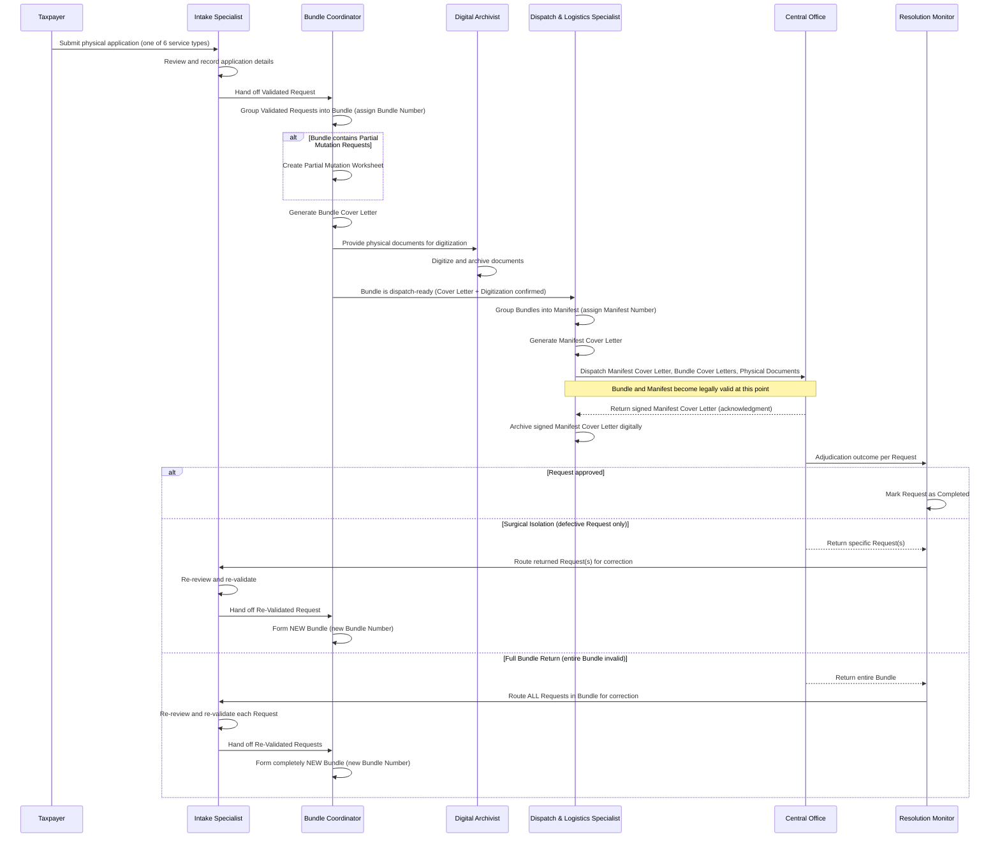

# Knowledge Base

## The content from [File](WORKFLOW_V2.md):

```markdown
ARCHITAX — Property Tax (PBB-P2) Workflow Management System
WORKFLOW.md — Functional Specification
Document Classification: Enterprise Functional Specification
Domain: Property Tax (Pajak Bumi dan Bangunan Perdesaan dan Perkotaan — PBB-P2)
Architecture Style: Enterprise Workflow Management System
Document Status: Final — Production Reference
Intended Audience: Backend Engineers, UI/UX Designers, QA Engineers, Business Analysts, Solution Architects, Operations Staff, Future Maintainers
Table of Contents
Workflow Philosophy
Workflow Objectives
End-to-End Business Process
BPM-Style Workflow Explanation
Detailed Step-by-Step Workflow
Responsibilities of Each Role
Bundle Lifecycle
Manifest Lifecycle
Request Lifecycle
State Transitions
Business Rules
Error Handling Strategy
Surgical Isolation Workflow
Full Bundle Return Workflow
Decision Tree for Choosing the Error Handling Method
Physical Document Flow
Digital Document Flow
Numbering System
Audit Trail Requirements
Validation Rules
Status Definitions
Sequence Diagram (Mermaid)
Flowchart (Mermaid)
State Diagram (Mermaid)
Edge Cases
Recovery Procedures
Operational Notes
Assumptions
Future Scalability Notes
Appendix
1. Workflow Philosophy
ARCHITAX formalizes the physical-to-digital lifecycle of a PBB-P2 property tax application as a deterministic, auditable, multi-actor enterprise workflow. The system is built on three non-negotiable architectural principles that govern every design decision in this document.
Principle of Hierarchical Containment. A Request is contained within a Bundle, and a Bundle is contained within a Manifest. Containment is one-directional and append-only at the point of dispatch: once a Bundle is dispatched inside a Manifest, the Manifest's composition is frozen. A Request cannot move between Bundles, and a Bundle cannot move between Manifests after dispatch. This containment model is what allows the workflow to isolate failure at the correct granularity instead of cascading failure upward.
Principle of Legal Validity Upon Dispatch. A Bundle becomes legally valid the moment it is dispatched. A Manifest becomes legally valid the moment it is dispatched. Legal validity is not retroactively revoked by downstream problems discovered in individual Requests. This is the architectural foundation that makes Surgical Isolation possible: the failure of a part does not legally invalidate the whole.
Principle of Minimum Necessary Disruption. When a defect is discovered, ARCHITAX always resolves it at the smallest organizational unit capable of containing the defect. A single bad Request returns only that Request. A structurally compromised Bundle returns only that Bundle. The Manifest — the largest unit of dispatch — is never recalled, because no single-Request or single-Bundle defect is permitted to be systemic enough to invalidate an entire Manifest. This principle is enforced by the Error Handling Policy in Sections 12–15 and is the single most important business rule in the entire system.
ARCHITAX is documentation of an existing, finalized government business process. This specification does not introduce new business logic, does not simplify existing steps, and does not propose process optimization. Every rule stated here is binding as written.
2. Workflow Objectives
The ARCHITAX workflow exists to achieve the following operational outcomes:
Provide an unbroken chain of custody for every physical property tax application, from the moment of taxpayer submission to final completion status.
Guarantee that every Request, Bundle, and Manifest is uniquely and permanently identifiable through a deterministic numbering system.
Enable parallel processing of multiple Requests without cross-contamination of validation outcomes between unrelated Requests.
Preserve legal continuity of dispatched Bundles and Manifests even when individual Requests inside them are later found defective.
Maintain a complete digital archive that mirrors the physical document trail, enabling reconstruction of any Request's history at any point in time.
Provide specialists with unambiguous, role-scoped responsibilities so that accountability for each workflow stage is traceable to a specific actor.
Constrain exception handling to exactly two deterministic mechanisms (Surgical Isolation and Full Bundle Return), eliminating ad-hoc or inconsistent error resolution.
Support eventual digitalization and scaling of the workflow without requiring redesign of its core state model.
3. End-to-End Business Process
At the highest level, ARCHITAX moves a property tax application through four macro-phases:

**Phase A — Intake and Validation.** A taxpayer submits a physical application for one of six service types. Intake Specialist reviews and records the application. This phase produces a validated Request.

**Phase B — Aggregation.** Bundle Coordinator aggregates Requests into Bundles. Digital Archivist performs digitization.

**Phase C — Manifesting, Dispatch, and Transit.** Dispatch & Logistics Specialist forms the Manifest, generates the Manifest Cover Letter, performs physical dispatch, and archives the signed acknowledgment.

**Phase D — Resolution and Completion.** The Central Office processes dispatched Requests and returns either individual problematic Requests (Surgical Isolation) or, in rare cases, an entire Bundle (Full Bundle Return). Resolution Monitor monitors and records the final disposition — Completed or Pending — of every dispatched Request. Returned Requests re-enter Phase B inside a brand-new Bundle; they are never re-inserted into their original container.

4. BPM-Style Workflow Explanation

In BPMN terms, ARCHITAX is modeled as a single collaborative process with two pools: the Internal Processing Office (Intake Specialist, Bundle Coordinator, Digital Archivist, Dispatch & Logistics Specialist, and Resolution Monitor) and the Central Office (external participant). The Internal Processing Office pool contains five sequential lanes, one per role, through which a Request token-flows from left to right.

The process begins with a Start Event ("Application Submitted") and is followed by a chain of Tasks, each owned by exactly one lane, reflecting the single-responsibility design of the workflow — no task is shared between two officers, and no officer performs another officer's task.

Two Sub-Processes exist within the flow:

- Bundle Formation Sub-Process (owned by the Bundle Coordinator): Produces the Bundle and Bundle Cover Letter, and conditionally produces a Partial Mutation Worksheet.

- Manifest Formation & Dispatch Sub-Process (owned by the Dispatch & Logistics Specialist): Aggregates Bundles into a Manifest, produces the Manifest Cover Letter, performs physical dispatch, and archives the signed acknowledgment.

Both sub-processes are aggregation tasks: they consume N upstream tokens (Requests or Bundles) and produce one downstream container token.

After dispatch (performed by the Dispatch & Logistics Specialist), the process crosses the pool boundary into the Central Office, which is modeled as a Black-Box Participant. ARCHITAX does not govern the Central Office's internal adjudication logic; it only receives two possible outcome messages re-entering the Internal Processing Office pool via a Message Event: 
- (a) a Surgical Isolation return message carrying one or more Request identifiers, or 
- (b) a Full Bundle Return message carrying a single Bundle identifier. Both message types are Exclusive Gateway branches off the same Central Office decision point.

The process terminates per-Request at one of two End Events: "Request Completed" or "Request Pending" (the latter representing a Request still awaiting further Central Office action, monitored indefinitely by the Resolution Monitor until it resolves to Completed or is returned).

Returned Requests (from either exception branch) loop back to the Bundle Formation Sub-Process as new tokens, entering a new Bundle instance — this is modeled as a loop-back edge that explicitly bypasses re-entry into the original Bundle's sub-process instance, adhering to the Principle of Hierarchical Containment.

5. Detailed Step-by-Step Workflow

| Step | Actor                           | Action                                                                                                        | Primary Output                                 |
| ---- | ------------------------------- | ------------------------------------------------------------------------------------------------------------- | ---------------------------------------------- |
| 1    | Taxpayer                        | Submits a physical application for one of six service types.                                                  | Physical Application Document                  |
| 2    | Intake Specialist               | Reviews the submitted application and records all details into the system.                                    | Validated Request Record                       |
| 3    | Bundle Coordinator              | Groups validated Requests into a Bundle and assigns a unique Bundle Number.                                   | Bundle (with Bundle Number)                    |
| 4    | Bundle Coordinator              | Creates a Partial Mutation Worksheet (if the service type is **Partial Mutation**).                           | Partial Mutation Worksheet                     |
| 5    | Bundle Coordinator              | Generates the Bundle Cover Letter.                                                                            | Bundle Cover Letter                            |
| 6    | Digital Archivist               | Digitizes and archives all physical Application Documents associated with the Bundle.                         | Digital Archive Entries                        |
| 7    | Dispatch & Logistics Specialist | Groups Bundles into a Manifest and assigns a unique Manifest Number.                                          | Manifest (with Manifest Number)                |
| 8    | Dispatch & Logistics Specialist | Generates the Manifest Cover Letter.                                                                          | Manifest Cover Letter                          |
| 9    | Dispatch & Logistics Specialist | Dispatches the Manifest Cover Letter, all Bundle Cover Letters, and physical documents to the Central Office. | Dispatched Package; Legal Validity Established |
| 10   | Dispatch & Logistics Specialist | Archives the signed (acknowledged) Manifest Cover Letter digitally upon its return.                           | Archived Signed Acknowledgment                 |
| 11   | Resolution Monitor              | Monitors the completion status of every Request and marks each as **Completed** or **Pending**.               | Final Request Disposition                      |

6. Responsibilities of Each Role
**Intake Specialist.** Single point of accountability for the accuracy of recorded application data. Verifies taxpayer identity documentation, property object identifiers, and service-type classification at the point of intake. The Intake Specialist's recorded data becomes the system-of-record for the Request and is never silently amended downstream — any correction after sign-off requires a return and re-submission cycle (Section 13).

**Bundle Coordinator.** Owns the formation of Bundles from validated Requests, including assignment of the Bundle Number, conditional creation of the Partial Mutation Worksheet, and generation of the Bundle Cover Letter. The Bundle Coordinator is the sole actor authorized to create a new Bundle, including replacement Bundles formed after a Surgical Isolation or Full Bundle Return event.

**Digital Archivist.** Owns conversion of physical Application Documents into the digital archive. Responsible for scan quality, correct association of digital records to the originating Request and Bundle identifiers, and archival retention compliance. The Digital Archivist does not alter the content or classification of any Request — digitization is a faithful reproduction function only.

**Dispatch & Logistics Specialist.** Owns the formation of Manifests from dispatch-ready Bundles, including assignment of the Manifest Number and generation of the Manifest Cover Letter. Verifies that every included Bundle has a completed Bundle Cover Letter and confirmed digitization status before inclusion. Also owns physical transmission of the Manifest package to the Central Office and digital archival of the signed Manifest Cover Letter upon acknowledgment. This role's action triggers legal validity of both the Bundle and the Manifest (Step 9).

**Resolution Monitor.** Owns post-dispatch tracking of every Request's final disposition. Records Central Office decisions (Completed, Pending, Surgical Isolation return, Full Bundle Return) against the correct Request and Bundle identifiers, and is the trigger point for re-entry of returned Requests into a new Bundle formation cycle via the Bundle Coordinator.

7. Bundle Lifecycle
A Bundle is the unit of mid-level aggregation between Request and Manifest. Its lifecycle is strictly linear up to dispatch, after which it bifurcates based on Central Office adjudication outcomes.
Formed — Bundle Coordinator groups one or more validated Requests and assigns a unique Bundle Number. The Bundle's Request List is fixed at this point; Requests are never added to a Bundle after formation.
Worksheet Attached (conditional) — if the Bundle contains Partial Mutation Requests, Bundle Coordinator attaches the Partial Mutation Worksheet.
Cover Letter Generated — Bundle Coordinator produces the Bundle Cover Letter (Bundle Number, Bundle Summary, Request List).
Digitized — Digital Archivist completes digitization and archival of every physical document belonging to every Request in the Bundle.
Manifested — Dispatch & Logistics Specialist includes the Bundle inside a Manifest. A Bundle belongs to exactly one Manifest for its entire lifecycle; it is never moved or re-included into a second Manifest.
Dispatched / Legally Valid — Dispatch & Logistics Specialist dispatches the parent Manifest, which carries the Bundle's Cover Letter and physical documents. The Bundle becomes legally valid at this instant and remains valid regardless of subsequent partial returns.
Post-Dispatch Disposition — the Bundle enters one of two terminal-or-ongoing states:
Partially Returned (Surgical Isolation) — one or more individual Requests are returned; the Bundle itself remains valid and open for monitoring on its non-returned Requests.
Fully Returned (Full Bundle Return) — the entire Bundle is invalidated; all Requests within it return to correction, and the Bundle is marked Closed/Superseded. A brand-new Bundle, with a new Bundle Number, is later formed by Bundle Coordinator from the corrected Requests.
Closed (Completed) — every Request inside the Bundle has reached a terminal Completed status and no further action is pending.
A Bundle, once dispatched, is never re-opened for the purpose of adding or removing Requests. The only two permitted post-dispatch transformations are the two outcomes above.
8. Manifest Lifecycle
Formed — Dispatch & Logistics Specialist groups one or more dispatch-ready Bundles and assigns a unique Manifest Number. The Bundle List is fixed at formation; Bundles are never added to a Manifest afterward.
Cover Letter Generated — Dispatch & Logistics Specialist produces the Manifest Cover Letter (Manifest Number, Manifest Summary, Bundle List, Signature Section).
Dispatched / Legally Valid — Dispatch & Logistics Specialist physically dispatches the Manifest Cover Letter, all Bundle Cover Letters, and all physical Application Documents to the Central Office. The Manifest becomes legally valid at this instant.
Acknowledged & Archived — Dispatch & Logistics Specialist receives the signed Manifest Cover Letter back from the Central Office and archives it digitally.
Monitored — Resolution Monitor tracks the disposition of every Request inside every Bundle inside the Manifest until all are resolved.
Closed — reached when every Bundle inside the Manifest has reached Closed status (whether Completed, or Closed/Superseded due to Full Bundle Return). A Manifest's closure is purely a status aggregation; it carries no legal effect, since the Manifest's legal validity is permanent from the moment of dispatch.
Binding Rule: A Manifest is never recalled, voided, or reopened for re-dispatch as a consequence of any Request-level or Bundle-level defect discovered after dispatch. The Manifest container is structurally immune to downstream defects in its contents — this is the architectural guarantee that makes Surgical Isolation and Full Bundle Return sufficient as the only two exception mechanisms.
9. Request Lifecycle
Submitted — Taxpayer submits the physical application.
Under Review — Intake Specialist reviews and records application details.
Validated — Intake Specialist completes recording; the Request is eligible for Bundle formation.
Bundled — Bundle Coordinator includes the Request in a Bundle.
Digitized — Digital Archivist completes digitization of the Request's physical document.
Manifested — the parent Bundle is included in a Manifest by Dispatch & Logistics Specialist.
Dispatched — the parent Manifest is dispatched by Dispatch & Logistics Specialist; the Request is now in Central Office adjudication.
Pending — default post-dispatch state while awaiting Central Office decision; tracked by Resolution Monitor.
Terminal state — one of:
Completed — Central Office finalizes the Request favorably; no further action.
Returned (Surgical Isolation) — Central Office returns this specific Request; it re-enters at state Returned-Pending Correction.
Returned (Full Bundle Return) — the Request's parent Bundle is fully invalidated; the Request re-enters at state Returned-Pending Correction, identically to a Surgical Isolation return from the Request's own perspective.
Returned-Pending Correction — the Request awaits correction (by Intake Specialist, in coordination with the taxpayer) before it can be re-bundled.
Re-Validated — corrected Request is re-approved by Intake Specialist.
Re-Bundled — the Request is included by Bundle Coordinator in a new Bundle (never the original), restarting the lifecycle from state 4 onward under a new Bundle Number.
A single Request may pass through states 4–12 multiple times across its real-world history if it is returned more than once. Each cycle is captured as a distinct, fully traceable lifecycle segment in the audit trail (Section 19), linked by the Request's permanent Request Number (Section 18).
10. State Transitions
10.1 Request State Transition Table
| From State | Event | To State | Trigger Role |
| --- | --- | --- | --- |
| (none) | Application submitted | Submitted | Taxpayer |
| Submitted | Review started | Under Review | Intake Specialist |
| Under Review | Review completed, data recorded | Validated | Intake Specialist |
| Validated | Included in Bundle | Bundled | Bundle Coordinator |
| Bundled | Document digitized | Digitized | Digital Archivist |
| Digitized | Parent Bundle included in Manifest | Manifested | Dispatch & Logistics Specialist |
| Manifested | Parent Manifest dispatched | Dispatched | Dispatch & Logistics Specialist |
| Dispatched | Awaiting Central Office decision | Pending | Resolution Monitor |
| Pending | Central Office finalizes favorably | Completed | Resolution Monitor |
| Pending | Central Office returns this Request only | Returned-Pending Correction | Resolution Monitor (recording Central Office decision) |
| Pending | Central Office fully returns parent Bundle | Returned-Pending Correction | Resolution Monitor (recording Central Office decision) |
| Returned-Pending Correction | Correction completed and re-validated | Re-Validated | Intake Specialist |
| Re-Validated | Included in a new Bundle | Bundled (new cycle) | Bundle Coordinator |

10.2 Bundle State Transition Table
| From State | Event | To State | Trigger Role |
| --- | --- | --- | --- |
| (none) | Requests grouped, Bundle Number assigned | Formed | Bundle Coordinator |
| Formed | Cover Letter generated | Cover Letter Generated | Bundle Coordinator |
| Cover Letter Generated | All member Requests digitized | Digitized | Digital Archivist |
| Digitized | Included in a Manifest | Manifested | Dispatch & Logistics Specialist |
| Manifested | Parent Manifest dispatched | Dispatched / Legally Valid | Dispatch & Logistics Specialist |
| Dispatched / Legally Valid | One or more member Requests returned | Partially Returned (still Valid) | Resolution Monitor |
| Dispatched / Legally Valid | Entire Bundle invalidated | Fully Returned / Closed-Superseded | Resolution Monitor |
| Dispatched / Legally Valid | All member Requests Completed | Closed (Completed) | Resolution Monitor |
| Partially Returned | Remaining member Requests Completed | Closed (Completed) | Resolution Monitor |

10.3 Manifest State Transition Table
| From State | Event | To State | Trigger Role |
| --- | --- | --- | --- |
| (none) | Bundles grouped, Manifest Number assigned | Formed | Dispatch & Logistics Specialist |
| Formed | Cover Letter generated | Cover Letter Generated | Dispatch & Logistics Specialist |
| Cover Letter Generated | Physically dispatched | Dispatched / Legally Valid | Dispatch & Logistics Specialist |
| Dispatched / Legally Valid | Signed Cover Letter archived | Acknowledged | Dispatch & Logistics Specialist |
| Acknowledged | All member Bundles reach Closed status | Closed | Resolution Monitor |

11. Business Rules
BR-01. A Request belongs to exactly one Bundle at any point in time. A Request may belong to multiple Bundles across its full history only if it has been returned and re-bundled — but never to more than one Bundle simultaneously.
BR-02. A Bundle belongs to exactly one Manifest for its entire lifecycle. A Bundle is never re-included in a second Manifest, even after a Full Bundle Return — the corrected Requests form a new Bundle, which itself is later included in a (possibly different) Manifest.
BR-03. A returned Request — whether returned via Surgical Isolation or Full Bundle Return — is never re-inserted into its original Bundle. It is only ever included in a newly formed Bundle.
BR-04. The Partial Mutation Worksheet is created if and only if the Bundle contains at least one Partial Mutation Request. It is never created for Bundles containing exclusively non-Partial-Mutation service types.
BR-05. A Bundle Cover Letter must contain exactly three elements: Bundle Number, Bundle Summary, and Request List. A Manifest Cover Letter must contain exactly four elements: Manifest Number, Manifest Summary, Bundle List, and Signature Section.
BR-06. Legal validity of a Bundle and legal validity of its parent Manifest are both established at the single moment of physical dispatch by Dispatch & Logistics Specialist (Step 9). Legal validity, once established, is permanent and is not retroactively revoked by any downstream event.
BR-07. The Manifest is never recalled, regardless of the number or severity of defects discovered in its constituent Bundles or Requests after dispatch.
BR-08. Exactly two exception mechanisms exist in ARCHITAX: Surgical Isolation and Full Bundle Return. No third exception path may be introduced at any organizational level.
BR-09. Surgical Isolation operates strictly at Request granularity. Full Bundle Return operates strictly at Bundle granularity. Neither mechanism may operate at Manifest granularity.
BR-10. A Bundle that is the subject of a Full Bundle Return is permanently marked Closed/Superseded and accepts no further Request additions, corrections, or re-dispatch under its original Bundle Number.
BR-11. Every digitized document must be traceable to its originating Request Number, Bundle Number, and Manifest Number through the digital archive (Section 17).
BR-12. Specialist roles are non-transferable for a given workflow instance: the specialist who performs Step N for a given Bundle or Manifest is recorded as the accountable actor for that step in the audit trail, regardless of which physical individual is staffing the role.
BR-13. A Request's terminal status is binary at any given lifecycle cycle: Completed or Pending-then-Returned. There is no third terminal status. "Returned" is not itself terminal — it is a re-entry trigger into a new lifecycle cycle.
BR-14. All Numbering (Request, Bundle, Manifest, Worksheet) is unique, sequential within its scope, and never reused — even for Closed/Superseded Bundles or completed Requests.
12. Error Handling Strategy
ARCHITAX recognizes exactly two exception mechanisms, applied exclusively after a Manifest has been dispatched and is therefore legally valid. No exception handling occurs, or is needed, prior to dispatch, because pre-dispatch defects are resolved through ordinary correction at Intake Specialist or Bundle Coordinator review — they are not workflow exceptions, they are routine quality gates.
| Mechanism | Approximate Frequency | Granularity | Effect on Bundle | Effect on Manifest |
| --- | --- | --- | --- | --- |
| Surgical Isolation | 90–95% of post-dispatch defect cases | Individual Request(s) | Remains valid; unaffected Requests continue normally | Remains valid; unaffected |
| Full Bundle Return | 5–10% of post-dispatch defect cases | Entire Bundle | Invalidated; Closed/Superseded | Remains valid; unaffected |
The governing logic is strictly hierarchical: the Central Office first determines whether the defect is isolated to specific Requests or is systemic to the Bundle's formation itself. This determination, and the criteria behind it, are described in Section 15 (Decision Tree). ARCHITAX's Internal Processing Office does not adjudicate which mechanism applies — that determination is made by the Central Office and is received as a message (return notice) which Resolution Monitor records.
13. Surgical Isolation Workflow
Definition. Surgical Isolation is the default exception-handling mechanism, applied when one or several individual Requests inside an otherwise valid Bundle are found problematic.
Trigger Condition. The Central Office identifies specific, individually defective Requests within a dispatched Bundle, while the Bundle's formation, classification, and grouping remain valid.
Process:
Central Office returns the specific defective Request(s), identified by Request Number, to the Internal Processing Office. The Bundle Number and Manifest Number under which they were originally dispatched remain on permanent record against these Requests for audit purposes.
Resolution Monitor records the return: the affected Request(s) transition to Returned-Pending Correction. All other Requests in the same Bundle are unaffected and continue their independent lifecycle progression.
The Bundle itself remains legally valid and is not reopened, modified, or reissued.
The physical document(s) for the returned Request(s) are routed back to Intake Specialist (via the taxpayer or directly, per the physical document return procedure) for correction.
Intake Specialist re-reviews the corrected Request and transitions it to Re-Validated.
Bundle Coordinator includes the re-validated Request in a brand-new Bundle, with a new Bundle Number. The original Bundle Number is never reused and the Request is never re-attached to its original Bundle.
The new Bundle proceeds through the full standard lifecycle (Sections 5, 7) — worksheet creation if applicable, Cover Letter generation, digitization, manifesting, and dispatch — independently of the original Bundle's status.
Outcome. The original Bundle's non-returned Requests proceed to Completed status normally. The returned Request(s) re-enter the workflow as new Bundle members and are tracked as a distinct lifecycle cycle, fully linked to the original cycle via the permanent Request Number.
14. Full Bundle Return Workflow
Definition. Full Bundle Return is the escalation exception-handling mechanism, applied when the Bundle itself — not merely individual Requests within it — is structurally or legally invalid.
Trigger Condition. Systemic defects in Bundle formation, including but not limited to: incorrect grouping logic, incorrect service-type classification applied at Bundle level, incorrect district assignment, a supermajority of Requests within the Bundle being individually invalid (such that Surgical Isolation would not meaningfully preserve the Bundle), or any condition under which the Bundle cannot legally continue to exist in its dispatched form.
Process:
Central Office returns the entire Bundle, identified by Bundle Number, to the Internal Processing Office. The parent Manifest Number remains on permanent record but is explicitly not affected.
Resolution Monitor records the return: the Bundle transitions to Fully Returned / Closed-Superseded. Every Request within the Bundle transitions to Returned-Pending Correction, regardless of whether each individual Request was itself defective.
The Manifest that originally carried this Bundle is not recalled, reopened, or invalidated. It remains legally valid and its other constituent Bundles are entirely unaffected.
All physical documents for every Request in the returned Bundle are routed back to Intake Specialist for review and correction.
Intake Specialist re-reviews each corrected Request and transitions each to Re-Validated individually.
Bundle Coordinator creates a completely new Bundle, with a new Bundle Number, from the corrected Requests. The original Bundle Number is permanently retired and never reused.
The new Bundle proceeds through the full standard lifecycle independently, and is later included in a Manifest — which may be the same Manifest cycle in calendar terms but is structurally a new Manifest instance, since the original Manifest is closed to new Bundle inclusion once dispatched (BR-02).
Outcome. The original Bundle is permanently retired in a Closed/Superseded state, preserved in the audit trail for traceability. All of its Requests are reconstituted into a new Bundle and re-enter the standard lifecycle. The parent Manifest's legal validity and composition are entirely untouched by this event.
15. Decision Tree for Choosing the Error Handling Method
The choice between Surgical Isolation and Full Bundle Return is made by the Central Office at adjudication time, based strictly on whether the defect is isolated to specific Requests or systemic to the Bundle's own formation. The decision logic, as reflected back into ARCHITAX through the return notice received by Resolution Monitor, follows this deterministic path:
Defect discovered in a dispatched Bundle
│
├── Is the defect confined to the content/validity of one or more
│   individual Requests, with the Bundle's own grouping, district
│   assignment, and service-type classification remaining correct?
│   │
│   ├── YES → Apply SURGICAL ISOLATION
│   │         Return only the specific defective Request(s).
│   │         Bundle remains valid. Manifest remains valid.
│   │
│   └── NO → continue to next check
│
├── Is the Bundle's own formation invalid — e.g. wrong grouping,
│   wrong service type at Bundle level, wrong district, or the
│   Bundle cannot legally continue to exist as constituted?
│   │
│   └── YES → Apply FULL BUNDLE RETURN
│             Return the entire Bundle.
│             Manifest remains valid (never recalled).
│
└── (No third path exists. Every post-dispatch defect resolves to
     exactly one of the two outcomes above. The Manifest itself
     is never the unit of return under any condition.)
This decision tree is binary by design (BR-08, BR-09): there is no scenario in which a defect is escalated past the Bundle level to the Manifest, and there is no scenario in which a third, undefined exception type is invoked. Any apparent ambiguity (for example, "most but not all Requests in a Bundle are defective") is resolved operationally by the Central Office's judgment of whether the Bundle's formation itself remains sound — not by a fixed numeric threshold — but the outcome is always one of exactly the two paths above.
16. Physical Document Flow
The physical document is the legally authoritative artifact throughout the pre-dispatch and dispatch stages of ARCHITAX. Its custody chain is as follows:
Taxpayer → Intake Specialist. The physical Application Document is handed over at submission. Intake Specialist takes first custody and performs intake review.
Intake Specialist → Bundle Coordinator. Upon validation, the physical document moves into Bundle formation custody. Bundle Coordinator physically groups documents matching the Bundle's Request List.
Bundle Coordinator → Digital Archivist (parallel branch). Physical documents are handed to Digital Archivist for digitization while remaining in the physical custody chain — digitization does not remove the physical document from the dispatch-bound custody path; it is a parallel non-destructive copy operation.
Digital Archivist → Dispatch & Logistics Specialist (custody returns to dispatch path). After digitization, physical documents are returned to the dispatch-bound custody chain, joined with the Bundle Cover Letter and, once Manifest formation is complete, the Manifest Cover Letter.
Dispatch & Logistics Specialist → Central Office. Physical Application Documents, together with the Manifest Cover Letter and all Bundle Cover Letters, are physically transported and delivered to the Central Office. This delivery event is what establishes legal validity (BR-06).
Central Office → Dispatch & Logistics Specialist (Manifest Cover Letter only). The Central Office returns the signed Manifest Cover Letter as acknowledgment of receipt; this is the only physical artifact that flows back to the Internal Processing Office as a matter of routine (non-exception) process.
Central Office → Intake Specialist (exception path only). Under Surgical Isolation or Full Bundle Return, the physical document(s) for the returned Request(s) are sent back to the Internal Processing Office and re-enter custody at Intake Specialist for correction. This is the only circumstance under which a physical Application Document re-enters the pre-dispatch portion of the workflow.
Physical documents for Completed Requests remain in Central Office custody following adjudication; ARCHITAX's physical custody responsibility for a given Request ends at successful dispatch (or, for returned Requests, resumes upon return).
17. Digital Document Flow
The digital archive is a non-authoritative but complete mirror of the physical document trail, maintained for traceability, audit, and recovery purposes.
Digitization (Digital Archivist). Every physical Application Document within a Bundle is scanned and stored, indexed against its Request Number, Bundle Number, and (once known) Manifest Number.
Bundle-level digital records. The Bundle Cover Letter and, where applicable, the Partial Mutation Worksheet are stored digitally at the point of generation by Bundle Coordinator, independent of and prior to Digital Archivist's document digitization completing.
Manifest-level digital records. The Manifest Cover Letter is stored digitally at the point of generation by Dispatch & Logistics Specialist, prior to dispatch.
Post-dispatch digital archival (Dispatch & Logistics Specialist). The signed Manifest Cover Letter, returned by the Central Office as acknowledgment, is digitally archived by Dispatch & Logistics Specialist. This is the only digital record created after the physical dispatch event, and its presence in the archive is the canonical digital evidence that dispatch and acknowledgment occurred.
Disposition records (Resolution Monitor). Every Completed, Pending, Surgical Isolation return, and Full Bundle Return event is recorded digitally against the affected Request Number(s) and Bundle Number, with a timestamp and the recording specialist's identity.
Returned-cycle digital linkage. When a Request is returned and re-bundled, its new lifecycle cycle's digital records are explicitly linked to its prior cycle's digital records via the permanent Request Number, preserving full historical traceability across multiple Bundle Numbers.
The digital archive never overwrites prior records; it is strictly append-only. Corrections to a Request are represented as new digital records in a new lifecycle cycle, not as edits to existing records (BR-14, audit trail Section 19).
18. Numbering System
All identifiers in ARCHITAX are unique, sequential within their defined scope, and permanently retired upon assignment — they are never reused, including for Closed/Superseded Bundles or completed Requests.
| Identifier | Format | Scope of Uniqueness | Example |
| --- | --- | --- | --- |
| Request Number | REQ-{ServiceTypeCode}-{DistrictCode}-{YYYY}-{NNNNNN} | National, permanent, never reused | REQ-PM-DKI03-2026-000482 |
| Bundle Number | BDL-{DistrictCode}-{YYYY}-{NNNNN} | National, permanent, never reused | BDL-DKI03-2026-00071 |
| Manifest Number | MFT-{DistrictCode}-{YYYY}-{NNNN} | National, permanent, never reused | MFT-DKI03-2026-0014 |
| Partial Mutation Worksheet Number | PMW-{Bundle Number}-{NN} | Scoped to parent Bundle | PMW-BDL-DKI03-2026-00071-01 |
Service Type Codes:`PM` (Partial Mutation), `FMU` (Full Mutation Update), `FMR` (Full Mutation Regular), `COR` (Correction), `NTO` (New Tax Object), `REA` (Reactivation).
Sequencing rule. The numeric suffix (`NNNNNN`, `NNNNN`, `NNNN`) increments strictly per district per calendar year, with zero-padding to the field width shown. Sequence numbers are issued at the moment of record creation (i.e., at Step 2 for Request Number, Step 3 for Bundle Number, Step 7 for Manifest Number) and are never pre-allocated or reserved in advance, preventing gaps caused by abandoned drafts.
Re-bundling rule. A returned Request retains its original, permanent Request Number across all lifecycle cycles. Only its Bundle Number changes upon re-bundling — a new Bundle Number is assigned by Bundle Coordinator at the new Bundle's formation (BR-03, BR-14).
19. Audit Trail Requirements
Every state-changing event in ARCHITAX must produce an immutable audit record containing, at minimum: the affected entity type (Request, Bundle, Manifest, Worksheet) and its identifier; the prior state and the new state; the timestamp of the transition; the recording specialist's role and identity (BR-12); and, for exception events (Surgical Isolation, Full Bundle Return), the originating Bundle Number and Manifest Number at the time of dispatch, regardless of later re-bundling.
AR-01. Audit records are append-only. No audit record is ever edited or deleted, including in cases of data-entry correction — corrections produce new, linked records, never overwritten history (Section 17).
AR-02. Every Request's full lifecycle — across all of its Bundle Number cycles, in the event of one or more returns — must be reconstructable as a single chronological history keyed by its permanent Request Number.
AR-03. Every Bundle's audit trail must show, at minimum: formation timestamp and Bundle Coordinator identity, Worksheet creation (if applicable), Cover Letter generation timestamp, digitization completion confirmation from Digital Archivist, inclusion in a Manifest with timestamp and Dispatch & Logistics Specialist identity, dispatch timestamp and Dispatch & Logistics Specialist identity, and final disposition (Closed/Completed or Fully Returned/Closed-Superseded) with Resolution Monitor identity and timestamp.
AR-04. Every Manifest's audit trail must show, at minimum: formation timestamp and Dispatch & Logistics Specialist identity, Cover Letter generation timestamp, dispatch timestamp and Dispatch & Logistics Specialist identity, signed Cover Letter archival timestamp, and the complete, immutable list of Bundle Numbers it contains.
AR-05. Exception events must be cross-referenced bidirectionally: a Surgical Isolation or Full Bundle Return record on a Request/Bundle must link forward to the new Bundle Number created as a result, and the new Bundle's audit trail must link backward to the originating exception event.
AR-06. Audit records must be queryable by any of: Request Number, Bundle Number, Manifest Number, Worksheet Number, district, service type, specialist identity, and date range, to support both routine reporting and government audit requests.
AR-07. The digital archive (Section 17) and the audit trail are distinct but cross-linked systems: the digital archive stores document content and cover letter content; the audit trail stores state-transition events. Every audit record referencing a generated document must link to that document's digital archive entry.
20. Validation Rules
VR-01 (Intake). Intake Specialist must verify, before transitioning a Request to Validated: taxpayer identity matches submitted identification documents; the property tax object identifier (NOP) is correctly recorded and exists or is being newly created consistent with the declared service type; the declared service type is consistent with the nature of the submitted documents; and all mandatory supporting documents for the specific service type are present.
VR-02 (Bundle Formation). Bundle Coordinator must verify, before assigning a Bundle Number: every included Request is in Validated state; every included Request belongs to the same district; every included Request is logically consistent with a single, coherent service-type grouping appropriate for joint dispatch (mixed service types are permitted within a Bundle only where district-level dispatch grouping conventions allow it — Section 28, Assumptions); and no Request already belongs to an existing, non-superseded Bundle.
VR-03 (Partial Mutation Worksheet). The Worksheet must be created if and only if at least one Request in the Bundle has service type Partial Mutation, and must enumerate the area/value split calculations for every such Request in the Bundle.
VR-04 (Bundle Cover Letter). Must contain a Bundle Summary whose Request count matches exactly the number of Requests in the Request List — a count mismatch is a blocking validation failure preventing Bundle dispatch-readiness.
VR-05 (Digitization Completeness). Dispatch & Logistics Specialist must not include a Bundle in a Manifest until Digital Archivist has confirmed 100% digitization completion for every Request's physical document within that Bundle.
VR-06 (Manifest Formation). Dispatch & Logistics Specialist must verify, before assigning a Manifest Number: every included Bundle has a generated Bundle Cover Letter; every included Bundle is digitization-complete; and no Bundle already belongs to an existing, non-superseded Manifest.
VR-07 (Manifest Cover Letter). Must contain a Manifest Summary whose Bundle count matches exactly the number of Bundles in the Bundle List, and the Signature Section must be present (though signature itself is appended physically by the Central Office upon receipt, not at generation time).
VR-08 (Dispatch Readiness). Dispatch & Logistics Specialist must not dispatch a Manifest unless the Manifest Cover Letter, every constituent Bundle Cover Letter, and every constituent physical Application Document are confirmed present in the dispatch package.
VR-09 (Re-Bundling). A returned Request must reach Re-Validated state (VR-01-equivalent re-check by Intake Specialist) before Bundle Coordinator may include it in a new Bundle. A returned Request may never be included directly into a new Bundle from Returned-Pending Correction state.
VR-10 (Numbering Integrity). Every newly assigned Request Number, Bundle Number, and Manifest Number must be checked against the full historical numbering ledger (Section 18) to guarantee non-collision and strict sequence continuity before being committed.
21. Status Definitions
| Status | Applies To | Definition |
| --- | --- | --- |
| Submitted | Request | Physical application has been handed over by the taxpayer; not yet reviewed. |
| Under Review | Request | Intake Specialist is actively reviewing and recording application details. |
| Validated | Request | Intake Specialist has confirmed all intake validation rules are satisfied; eligible for bundling. |
| Bundled | Request | Included in a Formed Bundle; awaiting digitization and/or manifesting. |
| Digitized | Request | Physical document has been scanned and archived by Digital Archivist. |
| Manifested | Request | Parent Bundle has been included in a Formed Manifest. |
| Dispatched | Request | Parent Manifest has been physically dispatched; Request is now legally in Central Office adjudication. |
| Pending | Request | Awaiting a Central Office decision; default state immediately after dispatch and the ongoing state until terminal resolution. |
| Completed | Request | Central Office has finalized the Request favorably; terminal state for this lifecycle cycle. |
| Returned-Pending Correction | Request | Returned via Surgical Isolation or Full Bundle Return; awaiting Intake Specialist re-review. |
| Re-Validated | Request | Corrected Request has passed Intake Specialist re-review; eligible for re-bundling. |
| Formed | Bundle / Manifest | Container has been assembled and assigned its unique number; composition is now fixed. |
| Cover Letter Generated | Bundle / Manifest | The respective Cover Letter document has been produced. |
| Digitized | Bundle | All member Requests' physical documents are confirmed digitized. |
| Manifested | Bundle | Bundle has been included in a Formed Manifest. |
| Dispatched / Legally Valid | Bundle / Manifest | Physical dispatch has occurred (Step 9); legal validity is established and permanent. |
| Acknowledged | Manifest | Signed Manifest Cover Letter has been received and archived by Dispatch & Logistics Specialist. |
| Partially Returned | Bundle | One or more, but not all, member Requests have been returned via Surgical Isolation; Bundle remains legally valid. |
| Fully Returned / Closed-Superseded | Bundle | Entire Bundle invalidated via Full Bundle Return; permanently retired, no further use of its Bundle Number. |
| Closed (Completed) | Bundle / Manifest | All member entities have reached a Completed (or, for Bundle, Closed-Superseded) status; aggregation status only, no legal effect. |
22. Sequence Diagram (Mermaid)


## 23. Flowchart (Mermaid)

```flowchart TD
    A[Taxpayer submits physical application] --> B[Intake Specialist: Review and record application details]
    B --> C{Intake Specialist validation passed?}
    C -- No --> B
    C -- Yes --> D[Bundle Coordinator: Group into Bundle, assign Bundle Number]
    D --> E{Contains Partial Mutation Request?}
    E -- Yes --> F[Bundle Coordinator: Create Partial Mutation Worksheet]
    E -- No --> G[Bundle Coordinator: Generate Bundle Cover Letter]
    F --> G
    G --> H[Digital Archivist: Digitize and archive documents]
    H --> I[Dispatch & Logistics Specialist: Group Bundles into Manifest, assign Manifest Number]
    I --> J[Dispatch & Logistics Specialist: Generate Manifest Cover Letter]
    J --> K[Dispatch & Logistics Specialist: Dispatch Manifest, Bundle Cover Letters, Physical Documents]
    K --> L[Bundle and Manifest become legally valid]
    L --> M[Dispatch & Logistics Specialist: Archive signed Manifest Cover Letter]
    M --> N[Resolution Monitor: Monitor Central Office adjudication]
    N --> O{Central Office decision}
    O -- Request Completed --> P[Resolution Monitor: Mark Request Completed]
    O -- Defect isolated to specific Request --> Q[SURGICAL ISOLATION: Return only defective Request]
    O -- Bundle systemically invalid --> R[FULL BUNDLE RETURN: Return entire Bundle]
    Q --> S[Bundle remains valid. Manifest remains valid.]
    R --> T[Bundle Closed-Superseded. Manifest remains valid.]
    S --> U[Intake Specialist: Re-review returned Request]
    T --> V[Intake Specialist: Re-review every Request in returned Bundle]
    U --> W[Bundle Coordinator: Form NEW Bundle with new Bundle Number]
    V --> W
    W --> D
    P --> X[Request lifecycle ends: Completed]
```

## 24. State Diagram (Mermaid)

```stateDiagram-v2
    [*] --> Submitted
    Submitted --> UnderReview : Intake Specialist begins review
    UnderReview --> Validated : Review complete
    Validated --> Bundled : Bundle Coordinator forms Bundle
    Bundled --> Digitized : Digital Archivist completes scan
    Digitized --> Manifested : Dispatch & Logistics Specialist forms Manifest
    Manifested --> Dispatched : Dispatch & Logistics Specialist dispatches
    Dispatched --> Pending : Awaiting Central Office
    Pending --> Completed : Central Office approves
    Pending --> ReturnedPendingCorrection : Surgical Isolation OR Full Bundle Return
    ReturnedPendingCorrection --> ReValidated : Intake Specialist re-review
    ReValidated --> Bundled : Bundle Coordinator forms NEW Bundle
    Completed --> [*]
stateDiagram-v2
    [*] --> Formed
    Formed --> CoverLetterGenerated : Bundle Coordinator generates Cover Letter
    CoverLetterGenerated --> BundleDigitized : Digital Archivist confirms digitization
    BundleDigitized --> BundleManifested : Dispatch & Logistics Specialist includes in Manifest
    BundleManifested --> DispatchedValid : Dispatch & Logistics Specialist dispatches parent Manifest
    DispatchedValid --> PartiallyReturned : Surgical Isolation on member Request(s)
    DispatchedValid --> FullyReturnedClosed : Full Bundle Return
    DispatchedValid --> ClosedCompleted : All member Requests Completed
    PartiallyReturned --> ClosedCompleted : Remaining Requests Completed
    FullyReturnedClosed --> [*]
    ClosedCompleted --> [*]
stateDiagram-v2
    [*] --> Formed
    Formed --> CoverLetterGenerated : Dispatch & Logistics Specialist generates Cover Letter
    CoverLetterGenerated --> DispatchedValid : Dispatch & Logistics Specialist dispatches
    DispatchedValid --> Acknowledged : Signed Cover Letter archived
    Acknowledged --> Closed : All member Bundles Closed
    Closed --> [*]
    note right of DispatchedValid
        Manifest is NEVER recalled,
        regardless of downstream
        Bundle or Request defects.
    end note
```

## 25. Edge Cases

The following 32 edge cases represent realistic government operational scenarios. Each is documented with Scenario, Cause, Expected Behaviour, Responsible Role, Status Changes, Physical Document Handling, Digital Record Handling, and Recovery Process.

* **EC-01: Incomplete Taxpayer Identity Recorded at Intake**
    * **Scenario:** Intake Specialist records a Request with a taxpayer identity number (NIK) that is incomplete.
    * **Cause:** Manual transcription error during intake review.
    * **Expected Behaviour:** Request blocked from transitioning to Validated; VR-01 not satisfied.
    * **Responsible Role:** Intake Specialist.
    * **Status Changes:** Remains Under Review.
    * **Physical/Digital Handling:** Document in Intake custody; no Request Number committed.
    * **Recovery:** Intake Specialist contacts taxpayer to complete NIK, then re-attempts validation.

* **EC-02: Duplicate Application for the Same Property Object**
    * **Scenario:** Two separate physical applications for the same tax object identifier (NOP) in the same period.
    * **Cause:** Taxpayer or co-owner error.
    * **Expected Behaviour:** Intake Specialist detects duplicate during VR-01.
    * **Responsible Role:** Intake Specialist.
    * **Status Changes:** Second submission held Under Review.
    * **Physical/Digital Handling:** Physical docs retained together; duplicate-flag annotated against NOP.
    * **Recovery:** Intake Specialist determines whether to merge, reject, or proceed with both as distinct (e.g., co-ownership).

* **EC-03: Wrong Service Type Declared by Taxpayer**
    * **Scenario:** Submission marked "New Tax Object" is actually a Correction.
    * **Cause:** Taxpayer misclassification.
    * **Expected Behaviour:** Intake Specialist re-classifies Request before validation.
    * **Responsible Role:** Intake Specialist.
    * **Status Changes:** Remains Under Review until correction, then Validated.
    * **Physical/Digital Handling:** Doc retained; intake form annotated.
    * **Recovery:** Intake Specialist corrects classification and confirms supporting documents match.

* **EC-04: Calculation Error in Partial Mutation Worksheet**
    * **Scenario:** Worksheet area/value split does not sum to parent total.
    * **Cause:** Manual calculation error by Bundle Coordinator.
    * **Expected Behaviour:** VR-03 blocks dispatch-readiness.
    * **Responsible Role:** Bundle Coordinator.
    * **Status Changes:** Bundle remains in Cover Letter Generated.
    * **Recovery:** Bundle Coordinator recalculates and re-verifies against VR-03.

* **EC-05: Bundle Formed Across Two Districts**
    * **Scenario:** Bundle discovered post-dispatch to contain Requests from two different administrative districts.
    * **Cause:** Bundle Coordinator VR-02 oversight.
    * **Expected Behaviour:** Central Office issues a Full Bundle Return.
    * **Responsible Role:** Resolution Monitor (record); Bundle Coordinator (replacement).
    * **Status Changes:** Bundle → Fully Returned/Closed-Superseded; member Requests → Returned-Pending Correction.
    * **Recovery:** Intake Specialist re-validates; Bundle Coordinator forms two district-correct Bundles.

* **EC-06: Bundle Summary Count Mismatch on Cover Letter**
    * **Scenario:** Cover Letter Summary states 12 Requests, Request List enumerates 11.
    * **Cause:** Bundle Coordinator clerical error.
    * **Expected Behaviour:** VR-04 blocks dispatch-readiness.
    * **Responsible Role:** Bundle Coordinator.
    * **Status Changes:** Held at Cover Letter Generated.
    * **Recovery:** Bundle Coordinator reconciles Request List and regenerates Cover Letter.

* **EC-07: Physical Document Misplaced During Digitization**
    * **Scenario:** Digital Archivist cannot locate a physical document.
    * **Cause:** Handling/filing error.
    * **Expected Behaviour:** Request not marked digitized; Bundle blocked from VR-05.
    * **Responsible Role:** Digital Archivist.
    * **Status Changes:** Request remains at Bundled.
    * **Recovery:** Custody-chain search per RP-01; if unrecoverable, Intake Specialist notifies taxpayer for duplicate.

* **EC-08: Illegible or Corrupted Digital Scan**
    * **Scenario:** Scanned document is illegible or corrupted.
    * **Cause:** Equipment/scanning error.
    * **Expected Behaviour:** Digitization not considered complete until legible.
    * **Responsible Role:** Digital Archivist.
    * **Status Changes:** Digitized status revoked/held.
    * **Recovery:** Re-scan original physical document and re-verify legibility.

* **EC-09: Manifest Groups Bundles from Two Fiscal Periods**
    * **Scenario:** Includes prior-year Bundle in current-year Manifest.
    * **Cause:** Oversight during VR-06 verification.
    * **Expected Behaviour:** VR-06 violation requiring correction (unless district policy permits).
    * **Responsible Role:** Dispatch & Logistics Specialist.
    * **Recovery:** Confirm policy compliance or remove out-of-period Bundle to separate Manifest.

* **EC-10: Manifest Cover Letter Missing Signature Section Before Dispatch**
    * **Scenario:** Signature Section not populated.
    * **Cause:** Generation error.
    * **Expected Behaviour:** VR-08 blocks dispatch.
    * **Responsible Role:** Dispatch & Logistics Specialist.
    * **Recovery:** Regenerate Manifest Cover Letter with Signature Section and re-verify VR-08.

* **EC-11: Physical Documents Lost in Transit to Central Office**
    * **Scenario:** Package does not arrive at Central Office.
    * **Cause:** Logistics/courier failure.
    * **Expected Behaviour:** Manifest/Bundle remain legally valid (BR-06).
    * **Responsible Role:** Dispatch & Logistics Specialist.
    * **Recovery:** Reprint from digital archive and re-deliver as supplemental delivery.

* **EC-12: Standard Surgical Isolation — Two of Fifteen Requests Returned**
    * **Scenario:** Central Office returns 2 of 15 Requests due to individual defects.
    * **Cause:** Individual Request-level deficiency.
    * **Expected Behaviour:** Standard Surgical Isolation; Bundle/remaining 13 Requests unaffected.
    * **Responsible Role:** Resolution Monitor (record); Intake Specialist (correction).
    * **Recovery:** Surgical Isolation process per Section 13.

* **EC-13: Full Bundle Return Due to Wrong Service Type at Bundle Level**
    * **Scenario:** Entire Bundle classification incorrect.
    * **Cause:** Bundle Coordinator misclassification (VR-02 oversight).
    * **Expected Behaviour:** Full Bundle Return per Section 14.
    * **Responsible Role:** Resolution Monitor (record); Intake Specialist (re-review).
    * **Recovery:** Intake Specialist re-validates; Bundle Coordinator forms new, correctly classified Bundle.

* **EC-14: Repeat Rejection of the Same Returned Request**
    * **Scenario:** Request returned, corrected, re-dispatched, and returned again for same error.
    * **Cause:** Insufficient correction.
    * **Expected Behaviour:** Request undergoes full Returned-Pending Correction cycle again.
    * **Responsible Role:** Intake Specialist.
    * **Recovery:** Deeper root-cause review before re-validation.

* **EC-15: Resolution Monitor Fails to Update Completion Status Within SLA**
    * **Scenario:** Request Pending beyond SLA; no disposition update.
    * **Cause:** Backlog or missed communication.
    * **Expected Behaviour:** Operational SLA breach flag; no workflow state error.
    * **Responsible Role:** Resolution Monitor.
    * **Recovery:** Follow up with Central Office.

* **EC-16: Taxpayer Withdraws Application After Bundle Dispatch**
    * **Scenario:** Taxpayer withdraws Request post-dispatch.
    * **Cause:** Change in taxpayer circumstances.
    * **Expected Behaviour:** Processed via Central-Office-side withdrawal (functionally Surgical Isolation).
    * **Responsible Role:** Resolution Monitor.
    * **Status Changes:** Request → Returned-Pending Correction (Withdrawn terminal annotation).
    * **Recovery:** Intake Specialist confirms withdrawal intent in writing.

* **EC-17: Duplicate Tax Object ID Across Two Separate Bundles**
    * **Scenario:** Same NOP appears in two different Bundles.
    * **Cause:** Failure of duplicate check across intake events.
    * **Expected Behaviour:** Central Office invalidates duplicate Request via Surgical Isolation.
    * **Responsible Role:** Resolution Monitor/Intake Specialist.
    * **Recovery:** Close duplicate as Withdrawn/Superseded.

* **EC-18: New Tax Object Request Bundled Without Required Field Verification**
    * **Scenario:** Mandatory field verification missing for NTO.
    * **Cause:** Intake Specialist omission.
    * **Expected Behaviour:** Central Office returns via Surgical Isolation.
    * **Responsible Role:** Intake Specialist.
    * **Recovery:** Perform verification, attach report, re-validate, re-bundle.

* **EC-19: Reactivation Request for a Tax Object Under Litigation**
    * **Scenario:** Request submitted for property in active legal dispute.
    * **Cause:** Taxpayer non-disclosure.
    * **Expected Behaviour:** Return via Surgical Isolation pending resolution.
    * **Responsible Role:** Resolution Monitor (record); Intake Specialist.
    * **Recovery:** Hold until litigation concludes; re-validate post-resolution.

* **EC-20: District Boundary Change After Bundle Formation, Before Dispatch**
    * **Scenario:** Boundary change occurs before dispatch.
    * **Cause:** Administrative reorganization.
    * **Expected Behaviour:** Pre-dispatch correction; Bundle re-numbered.
    * **Responsible Role:** Bundle Coordinator.
    * **Recovery:** Form new Bundle under correct district code.

* **EC-21: Bundle Number Collision Due to System Numbering Error**
    * **Scenario:** Two Bundles assigned same number.
    * **Cause:** Ledger fault (VR-10 violation).
    * **Expected Behaviour:** Critical data-integrity incident; immediate re-numbering.
    * **Recovery:** Correct ledger, re-issue conflict-free number.

* **EC-22: Manifest Number Collision**
    * **Scenario:** Two Manifests assigned same number.
    * **Cause:** Ledger fault.
    * **Expected Behaviour:** Immediate re-numbering for not-yet-dispatched Manifest.
    * **Recovery:** Re-issue conflict-free Manifest number.

* **EC-23: Bundle Exceeds Regulatory Maximum Request Count**
    * **Scenario:** Bundle count exceeds district regulation.
    * **Cause:** Oversight during formation.
    * **Expected Behaviour:** Hold until split into compliant Bundles.
    * **Responsible Role:** Bundle Coordinator.
    * **Recovery:** Split into multiple compliant Bundles.

* **EC-24: Previously Returned Bundle Mistakenly Re-Included in a New Manifest**
    * **Scenario:** Superseded Bundle included in Manifest.
    * **Cause:** VR-06 verification failure.
    * **Expected Behaviour:** Remove Bundle from Manifest immediately.
    * **Responsible Role:** Dispatch & Logistics Specialist.
    * **Recovery:** Remove Bundle, regenerate Manifest Cover Letter.

* **EC-25: System Downtime During Manifest Cover Letter Generation**
    * **Scenario:** Power/system failure during generation.
    * **Cause:** Infrastructure failure.
    * **Expected Behaviour:** Restart generation cleanly post-recovery.
    * **Responsible Role:** Dispatch & Logistics Specialist.
    * **Recovery:** Re-generate in full; re-verify VR-07.

* **EC-26: Bundle Cover Letter Missing from a Dispatched Package**
    * **Scenario:** Cover Letter missing post-dispatch.
    * **Cause:** Staging error.
    * **Expected Behaviour:** Logistics remediation; no legal validity reversal.
    * **Responsible Role:** Dispatch & Logistics Specialist.
    * **Recovery:** Supplemental delivery of missing Cover Letter.

* **EC-27: Central Office Acknowledges Receipt but Issues No Disposition Within Expected Timeframe**
    * **Scenario:** Receipt acknowledged but long delay in Request disposition.
    * **Cause:** Central Office backlog.
    * **Expected Behaviour:** Legitimate Pending status; escalation via inquiry.
    * **Responsible Role:** Resolution Monitor.
    * **Recovery:** Status inquiry follow-up.

* **EC-28: Partial Mutation Request Later Determined to Require Full Mutation Processing**
    * **Scenario:** Request misclassified as PM, should be FM.
    * **Cause:** Misclassification at intake (VR-01).
    * **Expected Behaviour:** Surgical Isolation return.
    * **Responsible Role:** Intake Specialist.
    * **Recovery:** Re-classify as FM, collect documentation, re-validate, re-bundle.

* **EC-29: Correction Request Submitted Twice for the Same Underlying Error**
    * **Scenario:** Taxpayer submits duplicate Correction.
    * **Cause:** Uncertainty/lack of confirmation.
    * **Expected Behaviour:** Treated as duplicate detection.
    * **Responsible Role:** Intake Specialist.
    * **Recovery:** Inform taxpayer of existing Request status.

* **EC-30: Intake Specialist Records Incorrect Taxpayer Identity Causing Downstream Legal Mismatch**
    * **Scenario:** Incorrect NIK discovered at Central Office cross-check.
    * **Cause:** Intake Specialist transcription error.
    * **Expected Behaviour:** Surgical Isolation return.
    * **Responsible Role:** Intake Specialist.
    * **Recovery:** Verify identity, correct NIK, re-validate, re-bundle.

* **EC-31: Audit Discovers a "Completed" Request Was Never Actually Dispatched**
    * **Scenario:** Record shows Completed, but no Dispatched event exists.
    * **Cause:** Data-entry error.
    * **Expected Behaviour:** Critical audit-trail violation; revert status.
    * **Responsible Role:** Resolution Monitor.
    * **Recovery:** Revert, identify true state, correct both records.

* **EC-32: Physical Archive Destroyed by Natural Disaster**
    * **Scenario:** Archive destroyed (flood/fire).
    * **Cause:** Force majeure.
    * **Expected Behaviour:** Digital archive serves as source of record.
    * **Responsible Role:** Digital Archivist.
    * **Recovery:** Reprint physical artifacts from digital archive as needed.

---

## 2. Recovery Procedures
* **RP-01 — Misplaced Physical Document Search:** Trace chain-of-custody backward. If unresolved, notify Intake for potential duplicate submission.
* **RP-02 — Numbering Collision Remediation:** Re-number later-created entity; earlier entity retains original number.
* **RP-03 — Transit Loss Remediation:** Reprint lost documents from digital archive and deliver as supplemental action.
* **RP-04 — Returned Request Re-Bundling:** Standard cycle: return to Intake → correct → re-validate → re-form Bundle → resume lifecycle.
* **RP-05 — Audit Trail Correction:** Never delete erroneous records; append correcting record referencing original.
* **RP-06 — Disaster Recovery of Digital Archive:** Use redundant, off-site storage to restore digital archive; re-print physical if required.
* **RP-07 — Litigation/Legal Hold Resolution:** Periodic review; re-validate (VR-01) upon resolution.

---

## 3. Operational Notes
* **Role Accountability:** Roles represent functional responsibilities; single staff may hold multiple, but audit logs must reflect the specific role performed (BR-12).
* **Service Types:** All six service types share the same workflow; intake validation (VR-01) and PM Worksheet (Section 5) are the only functional variants.
* **Aggregation Efficiency:** Bundle and Manifest sizes are district-level operational decisions, bounded by regulatory maximums (EC-23).
* **Indefinite Monitoring:** Resolution Monitor tracks Pending status indefinitely; no automatic timeouts exist.
* **Scope:** This specification covers the physical/digital hybrid process; fully digital transitions are future-scope (Section 29).

---

## 4. Assumptions
* **A-01:** Bundles consist of Requests within a single district; cross-district is always a defect (EC-05).
* **A-02:** District policy defines if service types can be mixed in one Bundle.
* **A-03:** Fiscal-period segregation is a district policy choice, verified at VR-06.
* **A-04:** Digital archive maintains redundant, off-site storage (RP-06).
* **A-05:** Central Office internal logic is outside ARCHITAX governance.
* **A-06:** Regulatory maximums (EC-23) are defined externally.
* **A-07:** Specialist roles have appropriate system access scoped to described actions.
* **A-08:** Numbering continuity (Section 18) is enforced by a centralized service.

---

## 5. Future Scalability Notes
* **Volume Scaling:** Numbering sequences support substantial growth; sequence widths are extensible.
* **Digital-First Migration:** Request lifecycle (Section 9) and validation (Section 20) remain valid for digital-only intake; only physical flow (Section 16) would be superseded.
* **Multi-Office Federation:** District-scoped identifiers inherently support multi-district operations without cross-district formation coordination.
* **Exception Mechanism Stability:** The Surgical Isolation/Full Bundle Return model is exhaustive (BR-08) and designed for hierarchical containment stability.
* **Automated Validation:** Deterministic rules (Section 20) are ready for direct implementation as pre-flight automation.
* **Audit/Reporting:** Structure supports scale (e.g., province/national rollups) without modifying per-entity audit records.

## 30. Appendix

### 30.1 Glossary

| Term | Definition |
| :--- | :--- |
| **Request** | A single taxpayer application for one of the six PBB-P2 service types, the atomic unit of the ARCHITAX workflow. |
| **Bundle** | A group of validated Requests, assigned a unique Bundle Number, forming the mid-level dispatch unit. |
| **Manifest** | A group of dispatch-ready Bundles, assigned a unique Manifest Number, forming the top-level physical dispatch unit. |
| **Bundle Cover Letter** | The generated document accompanying a Bundle, containing Bundle Number, Bundle Summary, and Request List. |
| **Manifest Cover Letter** | The generated document accompanying a Manifest, containing Manifest Number, Manifest Summary, Bundle List, and Signature Section. |
| **Partial Mutation Worksheet** | A supplementary document created only for Bundles containing Partial Mutation Requests, detailing area/value split calculations. |
| **Surgical Isolation** | The default exception mechanism returning only specific defective Request(s) while preserving Bundle and Manifest validity. |
| **Full Bundle Return** | The escalation exception mechanism returning an entire defective Bundle while preserving Manifest validity. |
| **NOP** | Nomor Objek Pajak — the unique tax object identifier for a property. |
| **NIK** | Nomor Induk Kependudukan — the taxpayer's national identity number. |
| **Central Office** | The external destination authority that receives dispatched Manifests and adjudicates Requests. |

### 30.2 Service Type Reference

| Service Type | Code |
| :--- | :--- |
| Partial Mutation | PM |
| Full Mutation Update | FMU |
| Full Mutation Regular | FMR |
| Correction | COR |
| New Tax Object | NTO |
| Reactivation | REA |

### 30.3 Role Quick Reference

| Role | Primary Accountability |
| :--- | :--- |
| Intake Specialist | Application Intake & Review |
| Bundle Coordinator | Bundle Coordination |
| Digital Archivist | Digitization & Archival |
| Dispatch & Logistics Specialist | Manifest Coordination, Dispatch & Logistics |
| Resolution Monitor | Completion Monitoring |

### 30.4 Document Revision Control

| Version | Status |
| :--- | :--- |
| 1.0 | Final |

### 30.5 Request Data Specification

Each Request (Application) consists of three primary data groups recorded by Intake Specialist during the intake phase.

| Data Group | Fields |
| :--- | :--- |
| **Primary Data** | Service Number, Service Type, Tax Object Number (NOP) |
| **SPPT Data (Existing)** | Owner Name, Owner Address, Block, RT, RW, Object Address, Block, RT, RW, Land Area, Building Area |
| **New Data** | Owner Name, Owner Address, Block, RT, RW, Object Address, Block, RT, RW, Land Area, Building Area, Proof of Ownership |

**Additional Provisions for New Data:**

* **Multi-Record for Partial Mutation:** Specifically for service type PM (Partial Mutation), the system must support multiple New Data records (one-to-many relationship) to document the resulting split of tax objects.
* **Data Integrity:** Data recorded by Intake Specialist becomes the permanent system-of-record and must not be unilaterally altered after the Validated status is achieved.

---
*End of WORKFLOW.md — ARCHITAX Property Tax (PBB-P2) Workflow Management System Functional Specification.*

